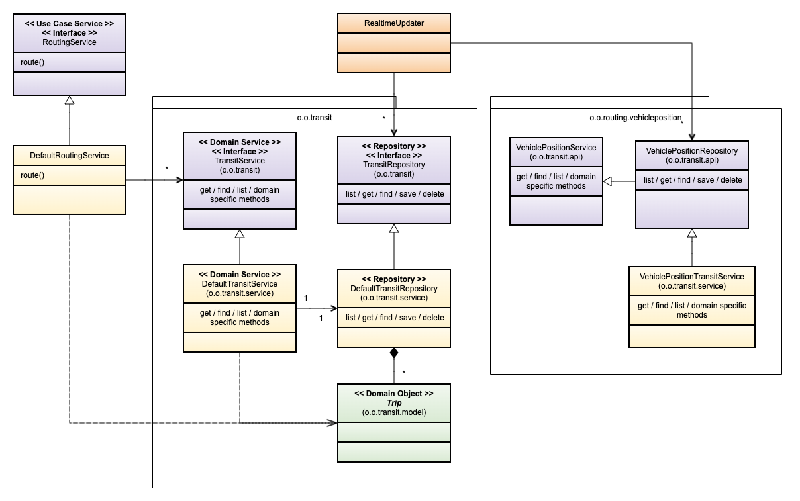

# Code Conventions

We try to follow these conventions or best practices. The goal is to get cleaner code and make the
review process easier:

- the developer knows what to expect
- the reviewer knows what to look for
- discussions and personal preferences can be avoided saving time
- new topics should be documented here

These conventions are not "hard" rules, and often there might be other forces which pull a
decision in another direction, in that case documenting your choice is often enough to pass the
review.

## Best practices - in focus

- [ ] Document `public` interfaces, classes and methods - especially those part of a module api.
- [ ] Leave Things BETTER than you found them - clean up code you visit or/and add unit tests.
- [ ] [DRY](https://en.wikipedia.org/wiki/Don%27t_repeat_yourself) - Do not repeat yourself. Avoid implementing the same business rule in two places -> refactor.
- [ ] [Feature envy](https://refactoring.guru/smells/feature-envy)
- [ ] Make types immutable if possible. References to other Entities might need to be mutable, if
      so try to init them once, and throw an exception if set again.
      Example:

```java
Builder initStop(Stop stop) {
   this.stop = requireNotInitialized(this.stop, stop);
}
```

## Naming Conventions

In general, we use American English. We use the GTFS terminology inside OTP as the transit domain
specific language. In cases where GTFS does not provide an alternative we use NeTEx. The naming
should follow the Java standard naming conventions. For example a "real-time updater" class
is named `RealTimeUpdater`. If in doubt check the Oxford Dictionary(American).


### Packages

Try to arrange code by domain functionality, not technology. The main structure of a package should
be `org.opentripplanner.<domain>.<component>.<sub-component>`.

| Package                         | Description                                                                                                                                                                                              |
| ------------------------------- |----------------------------------------------------------------------------------------------------------------------------------------------------------------------------------------------------------|
| `o.o.<domain>`                  | At the top level we should divide OTP into "domain"s like `apis`, `framework`, `transit`, `street`, `astar`, `raptor`, `feeds`, `updaters`, and `application`.                                           |
| `component` and `sub-component` | A group of packages/classes which naturally belong together, think aggregate as in Domain Driven Design.                                                                                                 |
| `component.api`                 | Used for components to define the programing interface for the component. If present, (see Raptor) all outside dependencies to the component should be through the `api`.                                |
| `component.model`               | Used to create a model of a Entites, ValueObjects, ++. If exposed outside the component you should include an entry point like `xyz.model.XyzModel` and/or a Service (in api or component root package). |
| `component.service`             | Implementation of the service like `DefaultTransitService`, may also contain use-case specific code. Note, the Service interface goes into the component root or `api`, not in the service package.      |
| `component.configure`           | Component creation/orchestration. Put Dependency Injection code here, like the Dagger Module.                                                                                                            |
| `support`                       | Sometimes domain logic get complicated, then extracting/isolating it helps. `support` is used internally in a component, not outside.                                                                    |
| `framework`                     | (Abstract) building blocks internal to a domain/parent package. In some cases accessed outside the component, e.g. `OptAppException`, `TransitEntity`.                                                   |
| `mapping`                       | Map between two domains/components.                                                                                                                                                                      |
| `util`                          | General "util" functionality, often characterized by `static` methods. Dependencies to other OTP packages is NOT allowed, only 3rd party utils libs.                                                     |
| `o.o.apis`                      | OTP external endpoints. Note! Many apis are in the Sandbox where they are in the `o.o.ext` package.                                                                                                      |

> **Note!** The above is the goal, the current package structure needs cleanup. 

> **Note!** Util methods depending on an OTP type/component should go into that type/component, not in the
utils class. E.g. static factory methods. Warning the "pure" utilities right now are placed into 
sub-packages of `o.o.util`, the root package needs cleanup.


### Methods

Here are a list of common prefixes used, and what to expect.

| Good method prefixes                                  | Description                                                                 |
|-------------------------------------------------------|-----------------------------------------------------------------------------|
| `stop() : Stop`                                       | Field accessor, equivalent to `getStop` as in the Java Bean standard        |
| `getStop(ID id) : Stop`                               | Get Stop by ID, throws exception if not found                               |
| `getStops(Collection<ID> id) : List/Collection<Stop>` | Get ALL Stops by set of IDs, throws exception if not found                  |
| `findStop(Criteria criteria) : Optional<Stop>`        | Find one or zero stops, return `Optional`                                   |
| `findStops(Criteria criteria) : List/Stream<Stop>`    | Find 0, 1 or many stops, return a collection or stream(List is preferred)   |
| `listStops() : List/Stream<Stop>`                     | List ALL stops in context, return a collection or stream(List is preferred) |
| `withStop(Stop stop) : Builder`                       | Set stop in builder, replacing existing value and return `this` builder     |
| `initStop(Stop stop) : void`                          | Set property ONCE, a second call throws an exception                        |
| `addStop(Stop stop) : void/Builder`                   | Add a stop to a collection of stops.                                        |
| `addStops(Collection<Stop> stops) : void/Builder`     | Add set of stops to existing set.                                           |
| `withBike(Consumer<BikePref.Builder> body) : Builder` | For nested builders use lambdas.                                            |

These prefixes are also "allowed", but not preferred - they have some kind of negative "force" to them.

| Ok method prefixes, but ...                 | Description                                                                                           |
| ------------------------------------------- | ----------------------------------------------------------------------------------------------------- |
| `withStops(Collection<Stop> stops) : this`) | Replace all stops in builder with new set, consider using `addStops(...)` instead                     |
| `setStop(Stop stop)`                        | Set a mutable stop reference. Avoid if not part of natural lifecycle. Use `initStop(...)` if possible |
| `getStop() : Stop`                          | Old style accessor, use the shorter form `stop() : Stop`                                              |

### Service, Model and Repository

 


Naming convention for builders with and without a context.

##### Graph Build and tests run without a context

```Java
// Create a new Stop
trip = Trip.of(id).withName("The Express").build();

// Modify and existing stop
stop = stop.copyOf().withPrivateCode("TEX").build();
```


## Records, POJOs and Builders

We prefer immutable typesafe types over flexibility and "short" class definitions. This make
the code more robust and less error-prune.

### Records

You may use records, but avoid using records if you can not encapsulate it properly. Be especially
aware of arrays fields (can not be protected) and collections (remember to make a defensive copy).
If you need to override `equals` and `hashCode`, then it is probably not worth it.
Be aware that `equals` compare references, not the value of a field. Consider overriding `toString`.

### Builders

OTP used a simple builder pattern in many places, especially when creating immutable types.

#### Builder conventions
- Use factory methods to create builder, either `of()` or `copyOf()`. The _copyOf_ uses an existing
  instance as its base. The `of()` creates a builder with all default values set. All constructors 
  should be private (or package local) to enforce the use of the factory methods.
- If the class have more than 5 fields avoid using an inner class builder, instead create a builder
  in the same package.
- Make all fields in the main class final to enforce immutability.
- Consider using utility methods for parameter checking, like `Objects#requireNonNull` and 
  `ObjectUtils.ifNotNull`.
- Validate all fields in the main type constructor(i.e. not in the builder), especially null checks. 
  Prefer default values over null-checks. All business logic using the type can rely on its validity.
- You may keep the original instance in the builder to avoid creating a new object if nothing 
  changed. This prevents polluting the heap for long-lived objects and make comparison very fast.
- There is no need to provide all get accessors in the Builder if not needed.
- Unit-test builders and verify all fields are copied over.
- For nested builders see the field `nested` in the example.

<details>
    <summary><b>Builder example</b></summary>

```Java
/**
 * THIS CLASS IS IMMUTABLE AND THREAD-SAFE
 */
public class A {
  public static final A DEFAULT = new A();
  private final List<String> names;
  private final int age;
  private final B nested;

  private A() {
    this.names = List.of("default");
    this.age = 7;
    this.nested = B.of();
  }

  private A(Builder builder) {
    this.names = List.copyOf(builder.names);
    this.age = builder.age;
    this.nested = builder.nested();

    if(age < 0 || age > 150) {
      throw new IllegalArgumentException("Age is out of range[0..150]: " + age);
    }
  }

  public static A.Builder of() { return DEFAULT.copyOf(); }
  public A.Builder copyOf() { return new Builder(this); }

  public List<String> listNames() { return names; }
  public int age()                { return age; }

  public boolean equals(Object other) { ... }
  public int hashCode()               { ... }
  public String toString()            { return ToStringBuilder.of(A.class)...; }

  public static class Builder {
    private final A original;
    private final List<String> names;
    private int age;
    private B.Builder nested = null;

    public Builder(A original) {
      this.original = original;
      this.names = new ArrayList<>(original.names);
      this.age = original.age;
    }

    public Builder withName(String name) { this.names.add(name); return this; }
    
    public int age()                     { return age; }
    public Builder withAge(int age)      { this.age = age; return this; }
    
    private B nested() { return nested==null ? original.nested() : nested.build(); } 
    public Builder withB(Consumer<B.Builder> body) {
      if(nested == null) { nested = original.nested.copyOf(); } 
      body.accept(nested);
      return this;
    }
    public A build() {
      A value = new A(this);
      return original.equals(value) ? original : value;
    }
  }
}
```

</details>


