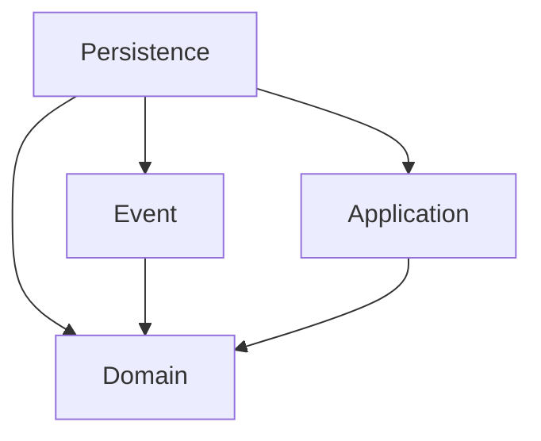

# Snapshot Implementation Prototype

This is a prototype for a multi repository snapshot implementation that satisfies the following requirements:
- atomic updates
- support for mutable repositories
- support for synchronous domain events

To have a working prototype, I also implemented a basic domain event system. 

## Design Ideas

### Persistence is not part of the business domain

The persistence is not part of the business logic, that's why it does not live in the domain package. (Think databases, a database would also not be part of the domain). That also means that there should be absolutely **no business logic inside the repositories**, only simple find/add/update/delete operations. This has the added benefit that business logic is clearly encapsulated from any persistence logic/indexing/... and should be much more clear. 

### All access to the data goes through `StateAccess`

`StateAcces` functions a bit like a database connection. All read and write operations go through it. It's responsible to create new snapshots after a write operation and also to always read from the most recent snapshot. It can be used like the following:

```java
String tripId = stateAccess.read(snapshot -> snapshot.timetables().getTripId());
stateAccess.write(ctx -> ctx.timetable().setTripId("123"));
```

Multiple read operations that depend on the state not changing in between reads will have to be submitted in one operation. For example:

```java
String result = stateAccess.read(snapshot -> {
    String id = snapshot.timetables().getTripId();
    // do calculations, routing,...
    id += "xyz";
    // read more stuff
    int numberOfRecalculations = snapshot.transfers().getNumberOfRecalculations();
    return id + numberOfRecalculations;
});
```

All operations are non-blocking.

More complex write operations with domain events, like trip updates, are also possible. `StateAccess#write` allows the use of the current write context, this context provides a `publish` method that can be used to publish domain events.

```java
TripUpdate update = new TripUpdate("newTrip", true);
stateAccess.write(ctx -> {
  TimetableRepo timetableRepo = ctx.timetable();
  var tripUpdateService = new TripUpdateService(timetableRepo, ctx::publish);
  tripUpdateService.doTripUpdate(update);
});
```

### `TransitWorld` is only meant to be a container for all repositories eligible for snapshotting

There needs to be a simple way of telling the snapshot mechanic which data to consider while creating snapshots. The `TransitWorld` object is a way of doing that. I don't intend there to be any business logic inside. In fact, the interface in the domain model is only needed for the domain events.

### Dependencies

This is according to hexagonal architecture or clean architecture. `Persistence` is in the boundary or adapter layer, `Application` and `Event` is the application layer and `Domain` is the core, or the domain model. Dependencies only go from the outside to the inside, meaning the domain has the least dependencies and focuses solely on the business logic. Any changes in the outer layers will never lead to the business logic having to be adapted.


