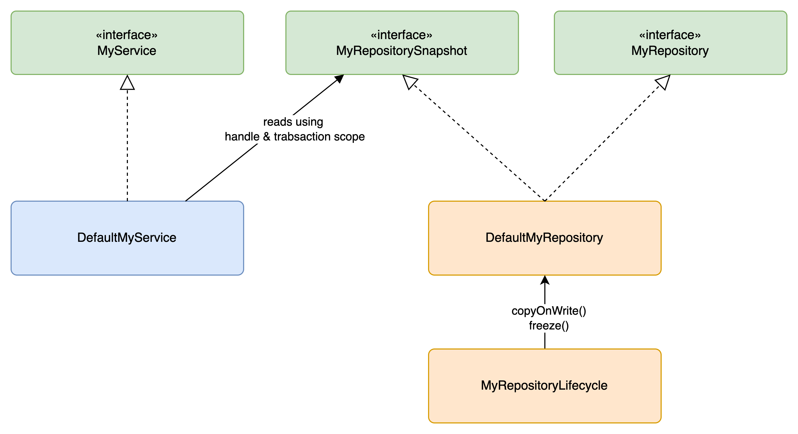
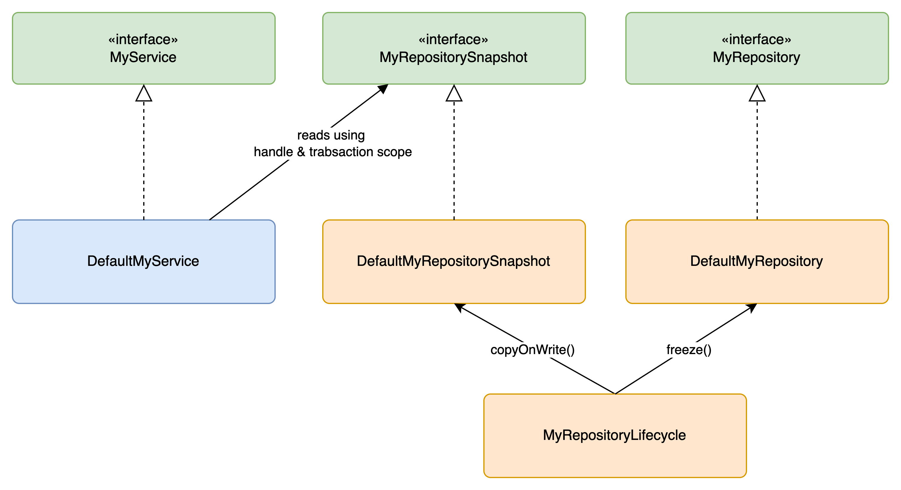

# Transaction Framework

This package is a reusable, generic mechanism for managing concurrent reads and writes to a set of
application-scoped repositories. It gives every repository the same multi-version, copy-on-write
concurrency model: any number of concurrent readers see a consistent, unchanging snapshot, while a
single writer thread applies changes and periodically (or atomically) publishes a new snapshot for
subsequent readers to see. No locking is required on the read path.

The model is a generalization of the timetable-snapshot concurrency approach described in
[`updater/package.md`](../../updater/package.md#realtime-concurrency). That document is still the
best source for the full rationale (why copy-on-write, why a single writer thread, why multiple
coexisting snapshots) — read it first if the "why" here feels thin. This package extracts the same
mechanism so any repository, not just the timetable, can use it without re-implementing the
snapshot/copy-on-write bookkeeping by hand.

## Core Concepts

| Type                        | Role                                                                                             |
| --------------------------- | ------------------------------------------------------------------------------------------------ |
| Repository snapshot (`S`)   | Immutable. Safe to share across threads and requests without synchronization.                    |
| Repository (`M`)            | Mutable. Exists only for the duration of a write task; never visible to readers.                 |
| `RepositoryLifecycle<S, M>` | `copyOnWrite(S) -> M` and `freeze(M) -> S`. The only place that needs to know both shapes.       |
| `RepositoryHandle<S, M>`    | Application-scoped, injected wherever a repository is read or written.                           |
| `RepositoryRegistry`        | Wiring-time registry of repositories; the source of a `TransactionScope`.                        |
| `TransactionScope`          | Request-scoped; pins all reads made through it to one consistent transaction.                    |
| `Transaction`               | Opaque version token minted on each commit; identifies one consistent state of all repositories. |
| `UpdateManager`             | The single public entry point for writes; owns the writer thread.                                |
| `WriteContext`              | Task-scoped; the only way to obtain a mutable repository or publish a domain event.              |

## Setup / Wiring

Wiring happens once, at application (or graph-build) startup, typically from a Dagger module:

1. `TransactionFactory.createRepositoryRegistry()` creates a `RepositoryRegistry`.
2. For each repository, `registry.registerRepository(repository, lifecycle)` (or
   `registerRepositorySnapshot(...)` if you already have an initial snapshot instead of a live
   repository) registers it and returns a `RepositoryHandle` — keep this handle and inject it
   wherever the repository is used. The handle is used to retrieve the repository from the
   `WriteContext` later.
3. `TransactionFactory.createUpdateManagerWithPeriodicCommits(name, registry, threadFactory, commitInterval)`
   (or `createUpdateManagerWithAtomicCommits(...)`) creates the `UpdateManager` bound to that
   registry.

There can be more than one `RepositoryRegistry`/`UpdateManager` pair in one application — for
example, one for transit data and one for street data. A `Transaction` is always bound to exactly
one `UpdateManager`; repositories registered on different registries are versioned independently,
and is updated in paralell, by two diffrent writer threads.

## Read Path

A request obtains a consistent view across every registered repository with two calls:

```java
TransactionScope scope = repositoryRegistry.scope();

var snapshot = aRepositoryHandle.repositorySnapshot(scope);
```

`TransactionScope` captures the current `Transaction` when it's created and holds a strong reference
to it for its lifetime. This matters because repository snapshots are cached in a `WeakHashMap`
keyed by `Transaction` — without a live scope holding the key, the cache entry (and the snapshot)
would be eligible for garbage collection mid-request. As long as the scope is alive, every
`repositorySnapshot(scope)` call — on any repository, at any point during the request — resolves
against the same transaction, so a request never sees one repository's data from before an update
and another's from after it.

## Write Path

There is exactly one writer thread per `UpdateManager`. Tasks are submitted with
`updateManager.submit(Consumer<WriteContext> task)` and run FIFO on that thread, so writes never
race each other and never need to be synchronized by the caller.

Within a task, `WriteContext` is the only way to reach a mutable repository or publish a domain
event:

```java
updateManager.submit(ctx -> {
  // Fetch the repository and write to it.
  var repo = ctx.repository(xRepositoryHandle);
  repo.save(entity);

  // Publish an event
  ctx.publish(new EntitySavedEvent(entity));
});
```

`UpdateManager` runs in one of two commit modes, chosen when the manager is created:

- **Atomic commit** (`createUpdateManagerWithAtomicCommits`) — the commit happens immediately after
  the task returns, and the `Future` returned by `submit` resolves only once that commit is done. If
  the task throws, the manager rolls back and the exception propagates through the `Future`.
- **Periodic commit** (`createUpdateManagerWithPeriodicCommits`) — the `Future` resolves as soon as
  the task completes; a background scheduler commits on a fixed interval
  (`TimetableSnapshotParameters.maxSnapshotFrequency()` configures it for the timetable use case).
  This trades slightly delayed visibility for batching the cost of publishing a new snapshot across
  many tasks.

Event handlers are wired once, at startup, with `updateManager.register(handler, repoHandle)`. When
a task calls `ctx.publish(event)`, every handler registered for that event's type is invoked
synchronously, and the mutable repository it's allowed to write to is injected at dispatch time —
this is how handlers reach a repository without a `WriteContext` of their own.

## Modeling a Repository

The recommended shape splits `Service`, `Repository`, and `RepositorySnapshot` into separate
interfaces. For the implementation a `DefaultService`, `DefaultRepository`, and
`DefaultRepositorySnapshot` is one option. This isn't the only way to structure the repository
implemetation. A single small aggregate can get away with just one `DefaultRepository` that
implements both `Repository` and `RepositorySnapshot`.





The lifecycle implementaion, `MyRepositoryLifeCycle`, needs to downcasts to the implementation to
reach `copyOnWrite`/`freeze`. This downcast feels a bit awkward, but it keeps the public API clean
and avoids exposing implementation details to the application code. Keeping the lifecycle
implementation in the same package as the repository implementation will isolate this downcast.

```java
public class MyRepositoryLifecycle
  implements RepositoryLifecycle<MyRepositorySnapshot, MyRepository> {

  @Override
  public MyRepository copyOnWrite(MyRepositorySnapshot snapshot) {
    return ((DefaultMyRepository) snapshot).copyOnWrite();
  }

  @Override
  public MyRepositorySnapshot freeze(MyRepository repository) {
    return ((DefaultMyRepository) repository).freeze();
  }
}
```

## Worked Example

`moduletest/candyshop` (in the test sources) is a minimal, runnable illustration: a candy shop with
`Customer` and `Order` repositories, wired up and exercised end to end by
`TransactionFrameworkTest`. It's worth reading in full; a few things it demonstrates that aren't
obvious from the API alone:

- **Two different lifecycle strategies, side by side.** `CustomerRepositoryLifecycle` does a real
  copy-on-write (`DefaultCustomerRepository.copyOnWrite()` returns a new instance backed by a copied
  map), so a failed task rolls back cleanly — the in-progress copy is simply discarded.
  `OrderRepositoryLifecycle`'s `copyOnWrite` instead returns `this`, which is cheaper (no copy on
  every task) but means a failed task's partial writes are _not_ rolled back — they leak into the
  next commit. `TransactionFrameworkTest.testRollback()` demonstrates the difference directly.
- **Visibility is commit-gated, not task-gated.** `testHappyDayScenario()` blocks a submitted task
  on a `CountDownLatch` and asserts that `registry.scope()` still sees the pre-task state until the
  task (and its atomic commit) actually completes.
- **`TransactionScope.toString()` is a debugging aid.** It renders as `Scope(TXN-<n>)`, which the
  tests assert on directly to pin down exactly which commit a given read is seeing.
