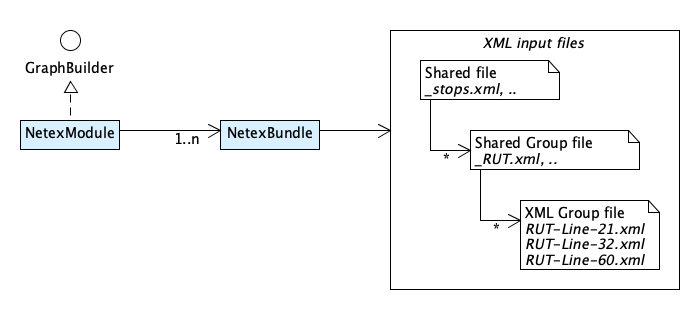
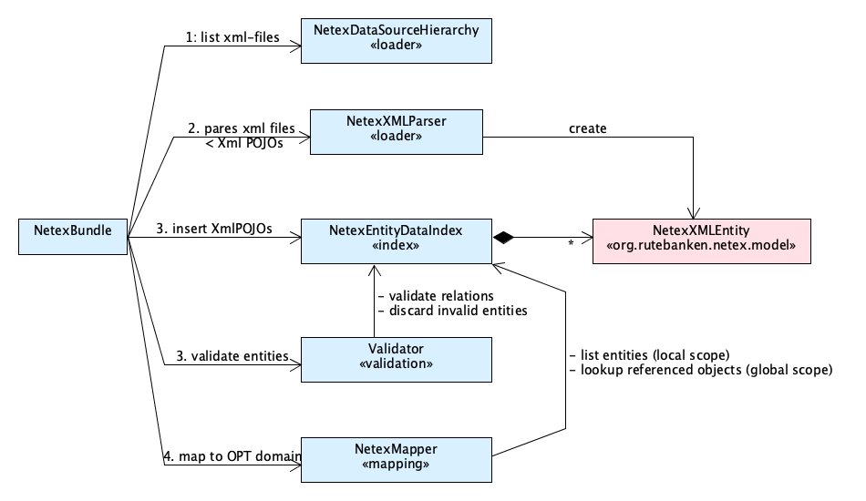
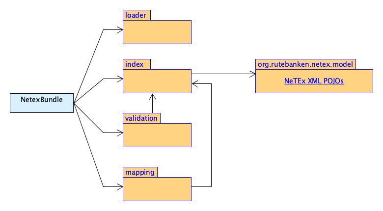

# NeTEx

NeTEx is a European standard for exchanging Transit data. OTP can import NeTEx into its internal
model. The XML parser support the entire NeTEx specification and is not limited to a specific
profile, but not every part of it is mapped into OTP. Only a small subset of the entities are
supported. When loading NeTEx data OTP should print warnings for all NeTEx data types not loaded.

OTP is tested with data from Entur which uses
the [Nordic NeTEx profile](https://enturas.atlassian.net/wiki/spaces/PUBLIC/pages/728891481/Nordic+NeTEx+Profile) 
and Data from HVV wich uses the [EPIP NeTEx Profile](http://www.normes-donnees-tc.org/wp-content/uploads/2019/11/WI00278457-TS16614-4-FV-e-Latest-Draft-sent-to-CEN.pdf). 
If you find that some part of your import is not imported/supported by OTP you will need to add
support for it in this model. NeTEx is huge, and ONLY data relevant for travel planning should be
imported.

OTP assume the data is valid and as a main rule the data is not washed or improved inside OTP. Poor
data quality should be fixed BEFORE loading the data into OTP. OTP will try to _ignores_ invalid
data, allowing the rest to be imported.

## Design Goals

- Import Transit data from NeTEx xml-files
- Handle large input file sets (10 GB)
- Allow some data to be shared and group other data together is an isolated scope
- Support for reading data fast, multi-threaded (the design support this, but not implemented jet)
- Warn or report issues on poor data, but keep building a graph so one "bad" line do not block the
  entire import.
- The import should put any restrictions on the order of XML types in the files. If ServiceJourney
  comes before Authority in the xml file - that should be ok. The file-hierarchy is an optional way
  to group and scope data.

## Design

The 2 main classes are the [`NetexModule`](NetexModule.java) and
the [`NetexBundle`](NetexBundle.java). The `NetexModule` is a `GraphBuilderModule` and responsible
for building all bundles, while a bundle is responsible for importing a Netex bundle, normally a
zip-file with a Netex data set. You may start OTP with as many bundles as you like, and you may mix
GTFS and NeTEx bundles in the same build.

The Netex files are _xml-files_ and one data set can be more than 5 GB in size. There is no fixed
relationship between file names and content like it is in GTFS, where for example `stops.txt`
contains all stops. Instead, OTP import Netex data based one a file hierarchy.

### Netex File Bundle

As seen above the _netex-file-bundle_ is organized in a hierarchy. This is done to support loading
large data set, and to avoid keeping XML DOM entities in memory. Also, the hierarchy prevent
references from different files at the same level to reference each other. The hierarchy allow OTP
to go through the steps of parsing xml data into Netex POJOs, validating the relationships and
mapping these POJOs into OTPs internal data model for *each set/group of files*.

The general rule is that entities referencing other entities, should be in the same file or placed
at a lover level in the hierarchy, so the referenced object already exist when mapping an entity.
There are exception to this. For example trip-to-trip interchanges.

The shared data si available during the entire mapping process. Then _group data_ is kept in memory
for the duration of _parsing_ and _mapping_ each group. Data in one group is not visible to another
group.

Within each group there is also _shared-group-data_ and _group-files_ (leaf-files).

- Entities in _group-files_ can reference other entities in the same file and entities in the
  _shared-group-files_ and in the global _shared-files_, but not entities in other _group-files_.
- Entities in _shared-group-files_ can reference other entities in the same file and entities in the
  same group of _shared-group-files_ and in the global _shared-files_, but not entities in any
  _group-files_.
- Entities in global _shared-files_ can reference other entities in the same file and entities in
  other global _shared-files_.

✅ Note! You can configure how your data files are grouped into the 3 levels above using regular
expressions in the _build-config.json_.

### Load entities, validate and map into the OTP model

For each level in the hierarchy and each group of files OTP perform the same steps:

1. Load XML entities (NeTEx XML DOM POJOs).
   See [`NetexDataSourceHierarchy`](loader/NetexDataSourceHierarchy.java)
1. Parse xml file and insert XML POJOs into the index.
   See [`NetexXmlParser`](loader/NetexXmlParser.java)
1. Validate relationships. See [`Validator`](validation/Validator.java)
1. Map XML entities to OPT internal model. See [`NetexMapper`](mapping/NetexMapper.java)

OTP load entities into a hierarchical [`NetexEntityDataIndex`](index/NetexEntityDataIndex.java)
before validating and mapping each entity. Entities may appear in any order in the _xml-files_. So,
doing the validation in a separate step ensure all entities is available when doing the validation.
If an entity or a required relation is missing the validator should remove the invalid entity. This
make the mapping easier, because the mapper can assume all required data and entities exist.

Here is an outline of the process including the file-hierarchy traversal and the steps at each
level:

1. Load _shared-data-files_ into _index_.
1. Validate loaded entities
1. Map _shared-data-entries_
1. For each group:
    1. Load _group-shared-files_ into index
    1. Validate loaded entities
    1. Map _group-shared-entries_
    1. For each leaf group-file file:
        1. Load _group-file_ into index
        1. Validate loaded entities
        1. Map _group-entries_
        1. Clear leaf data from index
    1. Remove group data from index

The [`NetexBundele`](NetexBundle.java) repeat the exact same steps for each group/set of files. To
emulate navigation in the hierarchy both the [`NetexEntityDataIndex`](index/NetexEntityIndex.java)
and the [`NetexMapper`](mapping/NetexMapper.java) persist data in a "Stack" like structure. The
`NetexBundle` call the `push()` and `pop()` on the index and the mapper to enter and exit each file
set at a given level. Entities loaded at a given level is in the local scope, while entities loaded
at a higher level is in the global scope. The index has methods to access both local and global
scoped entities, but it is only possible to add entities at the local scope.

## Package dependencies

