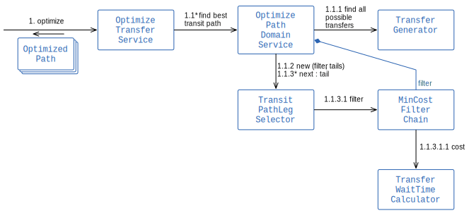
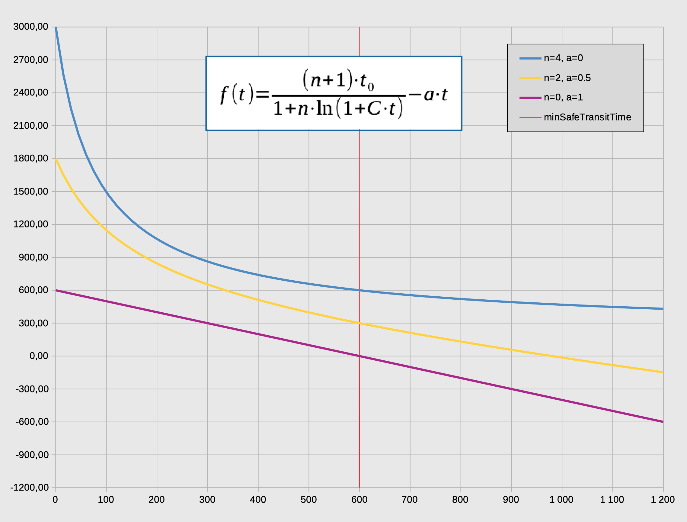

# Transfers / Interchanges

OTP2 handles transfers differently than OTP1. In OTP1, transfers were optimized by applying a cost
for each transfer edge during the search. In OTP2, finding the best transfers is done partially
during routing and then improved in a post-processing step. It is easier to understand how you
should tune OTP2 if you understand this process. When optimizing transfers we first find the best
paths
(sequences of trips), then identify the best stops to transfer between subsequent trips in each of
those paths (the post-processing).

## Supported Input Data

- OTP supports [GTFS Transfers.txt](https://gtfs.org/reference/static#transferstxt) and the Google
  extension
  with [Trip to Trip transfers](https://developers.google.com/transit/gtfs/reference/gtfs-extensions#TripToTripTransfers)
  .
- OTP
  supports [NeTEx Interchanges](https://enturas.atlassian.net/wiki/spaces/PUBLIC/pages/728760393/timetable#Interchange.1)
  as specified in the Nordic profile.

## Goals

1. Prefer paths with fewer transfers over many transfers.
2. Prefer some locations (stop pairs) over others.
3. Support `StaySeated` and `Guaranteed` transfers.
4. Choose the transfer with the highest priority: `Preferred` over `Recommended` over `Allowed`.
5. Support for transfer
   specificity, [Specificity of a transfer](https://developers.google.com/transit/gtfs/reference/gtfs-extensions#specificity-of-a-transfer)
   .
6. Prevent transfers between stops and/or trips/routes. GTFS Transfers `transfer_type = 3` and Netex
   Transfer `priority = -1(not allowed)`.
7. Find the best place to transfer between two transit trips in a path. Normally we want to maximize
   the "wait-time"/"extra-time" to allow the traveler to have as much time to do the transfer as
   possible.
    1. Maximize the wait-time
    2. For a journey with more than one transfer we want to distribute the wait-time, if possible.
       For a path with 2 transfers it is better to have 4 minutes extra for each transfer than
       having 30 seconds for one and 7m30s for the other.
    3. For a transfer between two trips we want to find the right balance, between
       extra-transfer-time and the path generalized-cost(like the cost of walking and riding a bus).

## Not Supported (jet)

- Using GTFS transfers.txt it is possible to set the `min_transfer_time` with `transfer_type = 2`.
  See issue [#3369](https://github.com/opentripplanner/OpenTripPlanner/issues/3369)
- The NeTEx Interchange MaximumWaitTime is ignored.
- Transfer not-allowed at location. See
  issue [#3505](https://github.com/opentripplanner/OpenTripPlanner/issues/3505).
- Support for Trip matching when only Route is specified in transfers.txt. See
  issue [#3429](https://github.com/opentripplanner/OpenTripPlanner/issues/3429)

## Implementation

OTP finds the best transfers in 2 steps:

1. As part of the routing. The routing engine (Raptor) applies generalized-cost and
   number-of-transfers as criteria during the routing. In addition, Raptor supports overriding
   regular transfers with constrained transfers.
    1. Goal 1 is achieved by having `number-of-transfers` as a Raptor criterion.
    2. Goal 2 is achieved by giving some stops a lower _visiting-cost_ according to the
       `StopTransferPriority`.
    3. Goal 3 and 6 is achieved by allowing constrained transfers to override regular transfers. An
       optional `RaptorTransferConstraintsProvider` is injected into Raptor which Raptor calls to
       get guaranteed transfers. This service is also responsible for rejecting a transfer(TODO).
2. Optimize transfers: Goal 4, 5, and 7 are achieved by post-processing paths. Paths from the
   routing search are revised, optimizing the stop at which transfers happen between each pair of
   transit rides (trips). This step does NOT compare different paths returned by the router
   (Raptor), but instead finds all possible transfer locations for a given path, and the different
   alternatives to transfer between each pair of trips within the path. This is an outline of the
   process:
    1. For each path find all possible permutations of transfers.
    2. Filter paths based on priority including `StaySeated=100`, `Guaranteed=10`, `Preferred=2`,
       `Recommended=1`, `Allowed=0` and `NotAllowed=-1000`. Each path is given a combined score, and
       the set of the paths with the lowest score is returned (more than one path might have the
       same score).
    3. Another filter which breaks ties based on an "optimize-transfer-cost" function.
    4. Because the number of permutations grow exponentially with the number of transfers, each
       filter above is applied for each sub-path starting from the end of the path. This keep the
       number of options down, close to O(N), where N is the number of transfers.

## Design - Optimize transfers

The `OptimizeTranferService` is the entry point and delegates to the "domain" services in
the `services` package. The result of the optimization process is an `OptimizedPath` found in the
`api` package. The optimization process first uses the `TransferGenerator` to find all possible
transfer points between each trip in a path. Then the `OptimizePathService` constructs all possible
paths starting at the "tail" with the egress-leg, and adds legs until the path is constructed. To
avoid exploring too many paths, the optimization filters the result of each step, reducing the set
of optimal tails. The `MinCostFilterChain` is used to filter each equivalent set of paths and
the `TransitPathLegSelector` finds the best tail for each transfer used to generate a new path-tail.

Here is an outline of the calls:



### Packages

Package `org.opentripplanner.routing.algorithm.transferoptimization` has the following subpackages:

- `api` classes used outside the transfer-optimization.
- `configure` creates and wires up the the module.
- `model` simple internal model classes used by the services.
- `services` internal transfer-optimization domain services, which collaborate to do the job.

### Important classes

The `TransferOptimizationServiceConfigurator` is responsible for creating and wiring up the module.
The configuration `TransferOptimizationParameters` is used to configure classes and inject the right
versions of each class. For example, the min-cost-filter-chain is created with the appropriate
filters to perform the filtering according to the configuration.

The `OptimizeTransferService` is the entry point of the service and responsible for delegating the
sub-tasks to the internal domain services. It is also responsible for the life-cycle, mainly
injecting 'setMinSafeTransferTime' before the calculation starts.

The `OptimizePathService` finds the best optimized path using the other domain services.

The `TransferGenerator` is responsible for finding all possible transfer options and decorating each
transfer with information that the other services will use later to do their job. The additional
information added to each transfer is:

- Constrained transfer information including priority, guaranteed, stay-seated and so on
- The various cost described in `TransferOptimized`:
    - `transfer-priority-cost`
    - `wait-time-optimized-cost` or `generalized-cost`
    - `break-tie-cost`

The `wait-time-optimized-cost` is described in [detail below](#the-optimize-transfer-cost-function).

The `TransitPathLegSelector` uses the filter-chain to prune the results already found before
combining them with new transfer-points and a new transit-path-leg.

The domain `OptimizedPathTail` is used to store the intermediate results. It decorates the `PathLeg`
from Raptor with `TransferOptimized` costs.

### The Optimize-transfer-cost Function

The optimize-transfer-cost function is used select between alternative transfers for a
"path" with the same set of on-board trips. This address goal 7 above:

1. Maximize the wait-time
2. Distribute the wait-time between transfers
3. Balance the wait-time cost and the generalized-cost

To compare two paths we need a cost function that account for the differences in the existing cost,
except the wait-time cost, and add a new inverse cost for the extra-time:

``` 
F(t) = path.generalized-cost - total-wait-time * waitReluctance + ∑ f(t)
```

The `∑ f(t)` is the sum over the new wait-time-cost-function `f(t)` where `t` is the wait-time for
each transfer in the path.

We have created a function with two parts:

- a linear decreasing component with a factor `a`. This should be adjusted to balance with the
  components of the path `generalized-cost`.
- an inverse logarithmic function which have a high cost for short wait-times. This function is
  relative to the calculated `min-safe-transfer-time`.

The `f(t)` is constructed so only 2 parameters are needed to tune it. Let:

- `t0` be the `min-safe-transfer-time`. This is defined as 6.67% of the total transit-time including
  board- and alight-slack across all paths found in the search. We want the `f(t)` to be relative to
  the travel-time, and fairly stable over time, independent of day of week. So, by excluding wait
  time we get an ok estimate for the journey travel duration.

Then the parameters used and available for configuration is:

- `a` the `inverse-wait-reluctance`. This factor is an inverse `waitReluctance`. For example, if it
  is set to 1, a wait-time of 10 seconds give a _reduction_ in cost of 10 cost points - the same as
  riding a bus for 10 seconds.
- `n` the `min-safe-wait-time-factor`. This defines the maximum cost for the logarithmic function
  relative to the `min-safe-transfer-time` when wait time goes towards zero(0).

The `f(t)` is created so:

- `f(0) = (n+1) * t0`
- `f(t0) = t0 - a * t0`, so if `a=1` then `f(t0)=0`.

Note that since we are comparing paths where the only difference is the transfers, the effect of the
function `f(t)` lies in the delta between the cost of transfer A for alternative 1 and the cost of
transfer B for alternative 2.

The function is:

```
               (n+1) * t0
f(t) =  -----------------------  -  a * t
         1 + n * ln(1 + C * t)
```

where the constant `C = (e - 1.0)/t0`.

Here is a plot with three examples with different values for `n` and `a` which illustrate how the
function look like when the linear, and the logarithmic part is present or not. The blue line have
only the logarithmic part(n=4, a=0), the purple line is a combination (n=2, a=0.5), and the yellow
line have the linear path only(n=0, a=1). The minimum-safe-transfer-time is set to 600s or 10
minutes in this case. Notice that the blue line gots from `f(0)=(n+1) * t0` to `f(t0)=t0` with
delta `n * t0`. The purple line goes from `f(0)=t0` to `f(t0)=0` with delta `-t0`.


