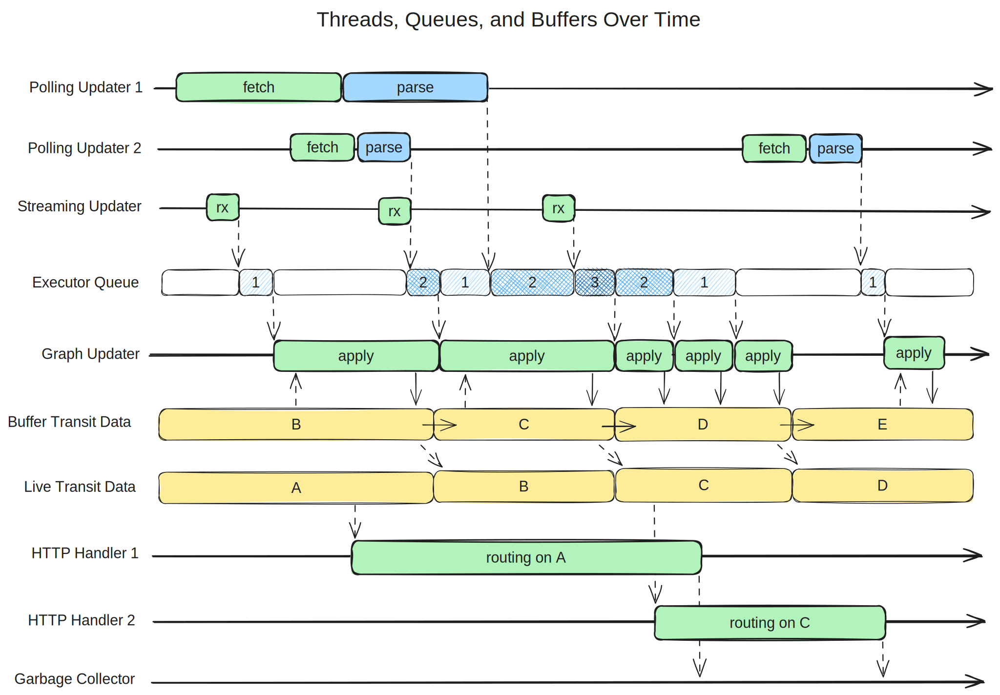
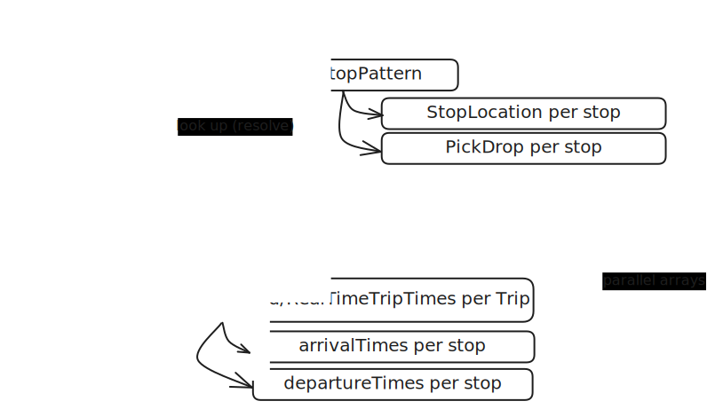
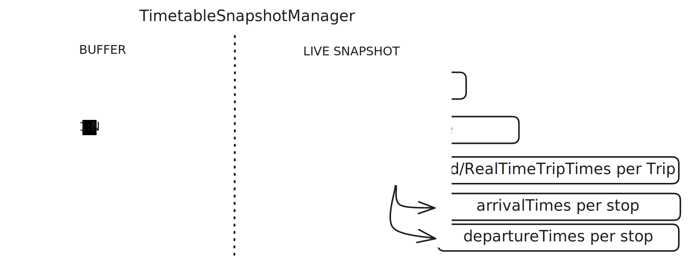
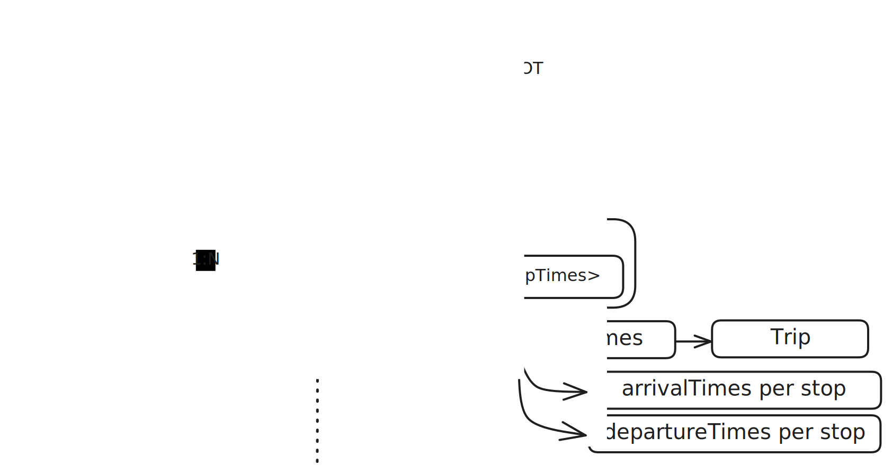
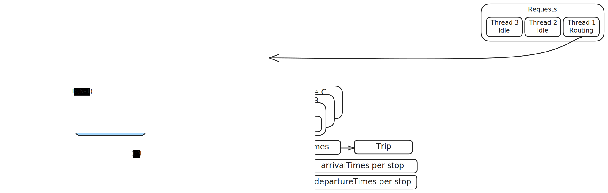
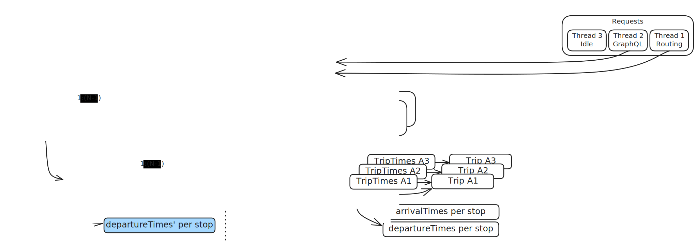
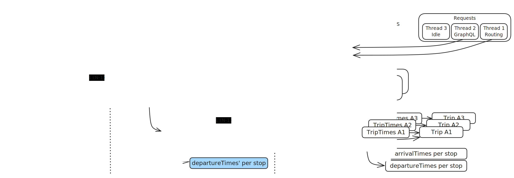
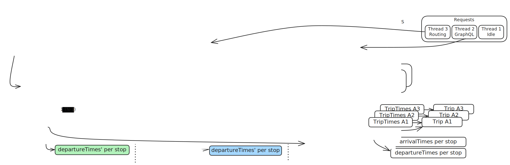
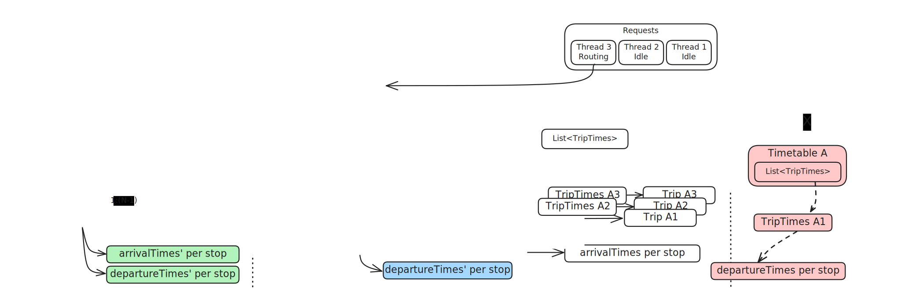
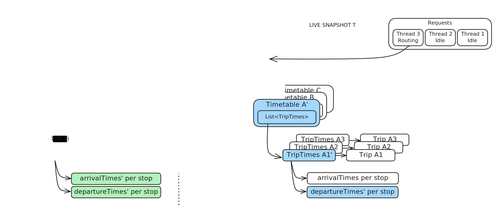

# Realtime Updaters

## Realtime Data Sources

Published transit data is broadly divided into two categories, which represent different time scales. On one hand we have scheduled data (also called planned or static data), and on the other hand realtime data. Scheduled data is supplied in GTFS or NeTEx format, with the corresponding realtime data supplied in the [GTFS-RT](https://gtfs.org/realtime/reference/) and [SIRI](https://www.siri-cen.eu/) formats, respectively. This package contains code that retrieves and decodes realtime data, then layers it on top of the static transit data in a live OTP instance while it continues to handle routing requests.

Different data producers might update their scheduled data every month, week, or day; some even update it multiple times per day. Realtime data then covers any changes to service at a timescale shorter than that of a given producer's scheduled data. Broadly speaking, realtime data represents short-term unexpected or unplanned changes that modify the planned schedules, and could require changes to journeys that the riders would not expect from the schedule. OpenTripPlanner uses three main categories of realtime data which are summarized in the table below. The SIRI specification includes more types, but OTP handles only these three that correspond to the three GTFS-RT types.

| GTFS-RT Name                                                                     | SIRI Name                | Description                                                           |
|----------------------------------------------------------------------------------|--------------------------|-----------------------------------------------------------------------|
| [Service Alert](https://gtfs.org/realtime/reference/#message-alert)              | Situation Exchange (SX)  | Text descriptions relevant to riders using a particular route or stop |
| [Trip Update](https://gtfs.org/realtime/reference/#message-tripupdate)           | Estimated Timetable (ET) | Observed or expected arrival and departure times for near-term trips  |
| [Vehicle Position](https://gtfs.org/realtime/reference/#message-vehicleposition) | Vehicle Monitoring (VM)  | Physical location of vehicles currently providing service             |

GTFS-RT takes the form of binary protocol buffer messages that are typically fetched over HTTP. On the other hand, the SIRI specification originally described SOAP remote procedure calls retrieving an XML representation of the messages. Various projects instead adopted simple HTTP GET requests passing parameters in the URL and optionally returning a JSON representation instead of XML. This latter approach was officially recognized as "SIRI Lite", has become quite common, and is the approach supported by OTP. 

Because OTP handles both GTFS-RT and SIRI data sources, there will often be two equivalent classes for retrieving and interpreting a particular kind of realtime data. For example, there is a SiriAlertsUpdateHandler and an AlertsUpdateHandler. The SIRI variants are typically prefixed with `Siri` while the GTFS-RT ones have no prefix for historical reasons (the GTFS-RT versions were originally the only ones). These should perhaps be renamed with a `GtfsRt` prefix for symmetry. Once the incoming messages have been decoded, they will ideally be mapped into a single internal class that was originally derived from GTFS-RT but has been extended to cover all information afforded by both GTFS and SIRI. For example, both classes mentioned above produce TransitAlert instances. These uniform internal representations can then be applied to the internal transit model using a single mechanism, independent of the message source type.

In practice, OTP does not yet use a single uniform internal representation for each of the three main message types. Particularly for TripUpdates/SIRI-ET, a lot of custom behavior was introduced for the SIRI case which led to a split between the two implementations. Our aim is to eventually merge the two systems back into one. NOTE: the comments on source code may be deceptive in cases where classes were copied and altered to handle SIRI data. This was sometimes done under time pressure to resolve production bugs. In these situations some comments were inadvertently duplicated without being updated.

## Realtime Concurrency

The following approach to realtime concurrency was devised around 2013 when OTP first started consuming realtime data that affected routing results rather than just displaying messages. At first, the whole realtime system followed this approach. Some aspects of this system were maintained in subsequent work over the years, but because the details and rationale were not fully documented, misinterpretations and subtle inconsistencies were introduced.

On 11 January 2024 a team of OTP developers reviewed this realtime concurrency approach together. The conclusion was that this approach remains sound, and that any consistency problems were not due to the approach itself, but rather due to its partial or erroneous implementation in realtime updater classes. Therefore, we decided to continue applying this approach in any new work on the realtime subsystem, at least until we encounter some situation that does not fit within this model. All existing realtime code that is not consistent with this approach should progressively be brought in line with it. 

In OTP's internal transit model, realtime data is currently stored separately from the scheduled data. This is only because realtime was originally introduced as an optional extra feature. Now that realtime is very commonly used, we intend to create a single unified transit model that will nonetheless continue to apply the same concurrency approach. 

The following is a sequence diagram showing how threads are intended to communicate. Unlike some common forms of sequence diagrams, time is on the horizontal axis here. Each horizontal line represents either a thread of execution (handling incoming realtime messages or routing requests) or a queue or buffer data structure. Dotted arrows represent object references being handed off, and solid arrows represent data being copied.

At the top of the diagram are the GraphUpdater implementations. These fall broadly into two categories: polling updaters and streaming updaters. Polling updaters periodically send a request to server (often just a simple HTTP server) which returns a file containing the latest version of the updates. Streaming updaters are generally built around libraries implementing message-oriented protocols such as MQTT or AMQP, which fire a callback each time a new message is received. Polling updaters tend to return a full dataset describing the entire system state on each polling operation, while streaming updaters tend to receive incremental messages targeting individual transit trips. As such, polling updaters execute relatively infrequently (perhaps every minute or two) and process large responses, while streaming updaters execute very frequently (often many times per second) and operate on small messages in short bursts. Polling updaters are simpler in many ways and make use of common HTTP server components, but they introduce significant latency and redundant communication. Streaming updaters require more purpose-built or custom-configured components including message brokers, but bandwidth consumption and latency are lower, allowing routing results to reflect vehicle delays and positions immediately after they're reported.

The GraphUpdaterManager coordinates all these updaters, and each runs freely in its own thread, receiving, deserializing, and validating data on its own schedule. Importantly, the GraphUpdaters are _not allowed to directly modify the transit data (Graph)_. Instead, they submit instances of GraphWriterRunnable which are queued up using the WriteToGraphCallback interface. These instances are essentially deferred code snippets that _are allowed_ to write to the Graph, but in a very controlled way. In short, there is exactly one thread that is allowed to make changes to the transit data, and those changes are queued up and executed in sequence, one at a time.

As mentioned above, these GraphWriterRunnable instances must write to the transit data model in a very controlled way, following specific rules. They operate on a buffer containing a shallow copy of the whole transit data structure, and apply a copy-on-write strategy to avoid corrupting existing objects that may be visible to other parts of the system. When an instance is copied for writing, any references to it in parent objects must also be updated. Therefore, writes cause cascading copy operations, and all instances in the object tree back up to the root of the transit data structure must also be copied. As an optimization, if a GraphWriterRunnable is able to determine that the protective copy has already been made in this buffer (the part of the structure it needs to modify is somehow marked as being "dirty") it does not need to make another copy. If the update involves reading the existing data structure before making a change, those reads should be performed within the same contiguous chunk of deferred logic that performs the corresponding write, ensuring that there are no data races between write operations.

This writable buffer of transit data is periodically made immutable and swapped into the role of a live snapshot, which is ready to be handed off to any incoming routing requests. Each time an immutable snapshot is created, a new writable buffer is created by making a shallow copy of the root instance in the transit data aggreagate. This functions like a double-buffering system, except that any number of snapshots can exist at once, and large subsets of the data can be shared across snapshots. As older snapshots (and their component parts) fall out of use, they are dereferenced and become eligible for garbage collection. Although the buffer swap could in principle occur after every write operation, it can incur significant copying and indexing overhead. When incremental message-oriented updaters are present this overhead would be incurred far more often than necessary. Therefore, snapshot publication is scheduled to occur regularly every few seconds, thereby reducing the total overhead without perceptibly increasing the latency of realtime information becoming visible to end users.

This is essentially a multi-version snapshot concurrency control system, inspired by widely used database engines (and in fact informed by books on transactional database design). The end result is a system where:

1. Write operations are simple to reason about and cannot conflict because only one write happens at a time.
1. Multiple read operations (including routing requests) can occur concurrently.
1. Read operations do not need to pause while writes are happening.
1. Read operations see only fully completed write operations, never partial writes.
1. Each read operation sees a consistent, unchanging view of the transit data.
1. Each external API request sees a consistent data set, meaning all services that the
   query directly or indirectly uses are operating on the same version of the data.

An important characteristic of this approach is that _no locking is necessary_. However, some form of synchronization is used during the buffer swap operation to impose a consistent view of the whole data structure via a happens-before relationship as defined by the Java memory model. While pointers to objects can be handed between threads with no read-tearing of the pointer itself, there is no guarantee that the web of objects pointed to will be consistent without some explicit synchronization at the hand-off.

For simplicity, the process of creating an immutable live snapshot (and a corresponding new writable buffer) is handled by Runnable on the single graph writer thread. This serves to defer any queued modifications until the new buffer is in place, without introducing any further locking mechanisms.

## Copy-on-Write Strategy in Timetable Snapshots

Below is a high-level diagram of how the timetable snapshots are used to look up arrival and departure times for a particular TripPattern. Each Route is associated with N different TripPatterns (essentially, N different unique sequences of stops). The TimetableSnapshot is used to look up a Timetable for a given TripPattern. That Timetable provides an unchanging view of both realtime-updated and original scheduled arrival/departure times for all trips that match the given TripPattern. The arrays of arrival and departure times for all these trips are parallel to the array of stops for the TripPattern used to look them up. They have the same length, and a given index corresponds to the same stop in any of these arrays. Note that this is a simplification; in reality the data structures are further broken down to reflect which services are running on each specific date.

Next, we will walk through a step-by-step diagram of how successive timetable snapshots are built up in a buffer, using a copy-on-write strategy to reuse as many object instances as possible (minimizing time and memory spent on copies) while ensuring that any existing snapshots visible to routing or API threads are consistent and unchanging. This is a more detailed look at the bottom half of the "Threads, Queues, and Buffers" diagram above, and particularly the yellow boxes near its center representing the buffered and live transit data. Each of the following diagrams shows the references between a tree of objects on the heap at a single moment in time, with time progressing as we move down the page.

In the first four diagrams below, each blue box represents a shallow-copied object, maintaining a protective copy of the minimal subtree at and above any leaf nodes that are changed by incoming realtime messages. These shallow copies are being created in a private buffer that is visible only to a single thread that is sequentially executing GraphWriterRunnables enqueued by GraphUpdaters. 

<!-- With  image syntax markdown sets all widths to 100%, completely ignoring the stated
     dimensions in each SVG file. Use HTML img tags to force width in percent, which is set to
     viewBox width divided by 20 to maintain relative sizes. -->

 
 

In preparation for applying updates, the collections in the root object of the buffer are shallow-copied. The collection objects themselves are duplicated, but the references they contain remain unchanged: they continue to reference the same existing Timetable instances.

 

At this point, the realtime system receives some updated departure times for the first trip on TripPattern A. This will require a change to a primitive array of departure times for that particular trip. All objects leading from the root of the snapshot down to that leaf array are copied in a selective deep copy. Specifically, the Timetable for TripPattern A and the first TripTimes within that Timetable are copied. All other elements in collections continue to point at the previously existing object instances. This is indicated by the (1:N-1) cardinality of the references pointing from the blue copied boxes back to the pre-existing white boxes.

From this step onward, the "requests" box on the right side of the diagram will demonstrate how the snapshots interact with incoming routing and API requests and garbage collection. One of the HTTP handler threads is actively performing routing, so has been given a request-scoped reference to the current live snapshot. 

 

In the next diagram, the selective deep copy is complete. The departure times have been updated, and are reachable from the root of the buffer snapshot, without affecting any pre-existing snapshots. The changes to the buffer are not published immediately; a series of changes is usually batched for publication every few seconds. Another incoming HTTP request, this time for the GraphQL API, is given a request-scoped reference to the same immutable live snapshot.

 

Every few seconds, the buffer contents are frozen ("committed" in database terms) and made available to routing and API services as a new "live snapshot". Once the snapshot is made visible to other threads, its entire object tree is immutable by convention. This immutability will eventually be enforced in code. The process of applying single-threaded updates to the private buffer begins anew. The blue instances have been promoted to become the current live snapshot. Green boxes will now represent the minimal subtree of shallow protective copies in the private buffer. Note that the two HTTP requests are still in progress, and retain their references to the previous, unchanging snapshot S even though we have published a new snapshot T. In this way, each request maintains a consistent view of all the transit data until it completes.

 

Now the realtime system receives some updated arrival and departure times for the third trip in TripPattern B. It again makes a protective copy of all items from the root of the snapshot down to the leaf arrays it needs to update. This includes the Timetable for TripPattern B and the third TripTimes in that Timetable, as well as some primitive arrays. The copied collections in the buffer now contain a mixture of references to white, blue, and green objects from three generations of snapshots. Both live snapshots S and T remain unchanged by the writes to the copies in the buffer, even though the buffer reuses most of the instances in these previous snapshots. Note: In the original (white) snapshot, the TripTimes are only shown for the frontmost Timetable A in the pile. Timetables B and C are also implied to have TripTimes B1, B2, B3... and C1, C2, C3... and associated Trips and time arrays, which are not shown to avoid clutter. For this reason, the protective copies of Timetable B and TripTimes B3 (in green) are shown pointing in the general direction of this tree of pre-existing objects, not at specific individual objects.

The routing request has now completed and released its reference to the original snapshot S (white). But another routing request has arrived on another HTTP handler thread, and is given a request-scoped reference to the current live snapshot T (blue).

 

Once the GraphQL request completes, no threads are using the old snapshot S (white) anymore. That snapshot will now be garbage collected, transitively releasing any objects that are no longer used because they've been superseded by protective copies.

 

Without any further active steps by OTP or the JVM, simply rearranging elements of the diagram after garbage collection occurs reveals that our routing thread is seeing a full coherent snapshot composed of objects created over the course of several subsequent snapshots. The buffer (green) will soon be promoted to the current live snapshot and the cycle continues.

 

## Design Considerations

This section summarizes the rationale behind some of the design decisions.

### Realtime is Highly Concurrent

An OTP instance can have multiple sources of realtime data at once. In some cases the transit data includes several feeds of scheduled data from different providers, with one or more types of realtime updates for those different feeds.

In a large production OTP deployment, input data may be integrated into a single data source by an upstream system, or left as multiple data sources with guarantees about the uniqueness of identifiers. In either case, the single unified ID namespace allows realtime data to be easily associated with transit model entities. In practice, many OTP deployments do not have upstream data integration pipelines. In these cases OTP must manage several independent static and realtime data sources at once; feed IDs are used to keep namespaces separate, and to associate realtime data with the right subset of entities. Even when data feeds are well-integrated, the different kinds of realtime (arrival time updates, vehicle positions, or text alerts) may be split across multiple feeds as described in the GTFS-RT spec, which implies polling three different files. To handle these cases, it must be possible for more than one data source to specify the same feed ID. Eventually we want to make these feed IDs optional to simplify single-namespace OTP deployments.

Each OTP instance in such a large configuration is also typically intended to handle several requests concurrently. Each incoming request needs to perform essentially random reads from the same large data structure representing the transit network, so there are efficiency benefits to many concurrent searches happening on the same instance, sharing this one large data structure. In a load-balanced cluster of OTP instances, realtime updates must be received and applied to each copy of the transportation network separately. So sharing each copy of the transportation network between a larger number of concurrent routing requests reduces the number of identical, arguably redundant network update processes going on simultaneously.  

In OTP the combined static and realtime transit data is a relatively large, deeply nested and interconnected data structure. It would take time to copy that structure, and especially to perform a deep copy of every nested object. Within a single instance, making multiple totally independent copies of this structure for different successive snapshots would tend to scatter reads from different routing threads across widely dispersed memory addresses, reducing cache efficiency. It could also lead to high (or highly variable) memory usage. In order to make updates to the transit data available frequently (as often as once every second, or as quickly as possible after each individual message comes in) we do not want to completely replicate the entire transit data structure for each snapshot. This would consume a significant fraction of the instance's available resources and likely degrade the aggregate performance of concurrently handled requests.

### No Destructive Changes to Scheduled Data

TripUpdates/SIRI-ET timetables cannot simply replace (overwrite) the original scheduled data. The updated timetables must be stored alongside the original scheduled ones. We need to retain the original data for several reasons. First, some routing requests should not be affected by realtime updates. The most obvious example is searches on future dates, which must use the scheduled trip objects. It is also common to show users delays relative to the originally planned schedule (like `8:30 +5min`). When a realtime disruption is severe enough, users may also expect or need to see the resulting itinerary in comparison with the one they expected to see in the absence of real-time disruptions.

### Multiple Coexisting Read-only Snapshots

Routing requests are relatively slow. They may take many seconds to process, and the response time is highly variable. For the duration that OTP is handling a single request, that request should see an effectively immutable, unchanging snapshot of the transit data. Even if new updates are constantly streaming in, each individual request must see a stable and unchanging view that remains internally consistent. Both the incoming realtime updates and the routing requests must behave like transactions that are “serializable” in the database concurrency control sense of the term: from any externally visible perspective, everything appears as if the reads and writes all happened in contiguous blocks in a single non-branching sequence, one after the other, even though much of the work is being done on threads in parallel.

We take advantage of Java’s garbage collected environment here: once snapshots are no longer in use by any active routing code, they become unreferenced and are candidates for garbage collection. Of course the vast majority of the nested sub-objects used by a snapshot may still be in use, referenced by one or more successive snapshots that did not modify them, and therefore reused indefinitely. As long as each successive snapshot treats the previous ones (and all their nested sub-objects) as immutable, applying a copy-on-write policy to incorporate new information arriving in realtime updates, the garbage collector will weed out and deallocate subtrees as they are invalidated by those incoming realtime updates, once they are no longer needed by any active routing request.

At any given moment there is a single most recent read-only snapshot of transit data, which is the one that will be handed off to any incoming routing requests. But when that single snapshot is updated, any requests that are currently executing will continue to hold their older snapshots. In this way there is always a single current snapshot, but an unlimited number of concurrently visible snapshots, each of which is being used by an unlimited number of concurrent routing requests.

### Tolerance for Update Latency

We don’t need every update for every individual trip to become visible to routing operations and end users independently of all other updates. We can batch updates together to a varying degree, trading off the number of separate snapshots present in memory at a given moment against the rapidity with which updates become visible to routing and to end users. Snapshots could be provided to the routing code on demand: if no requests are coming in, a series of individual updates will apply one after another to the same temporary buffer. As soon as a request comes in and needs a stable snapshot of the transit data to work with, the buffered set of transit data will be handed off to that request and subsequent updates applied to a new buffer in a copy-on-write fashion. However, a typical large system will require several load-balanced OTP instances that are essentially always busy, so such idle periods will rarely or never exist. Instead, we can create the same batching effect even with a continuous stream of incoming requests. For some period of time, typically a few seconds, all incoming requests will continue to be handed the last finalized snapshot and updates will accumulate to the new buffer. A new snapshot is created at regular intervals, independent of how many requests are arriving at the moment. This approach is also better for sparse reqeusts in that any pause or other overhead associated with snapshot creation is not incurred while the client is waiting, but rather proactively on its own thread. Clients always grab the latest available snapshot with no delay at all.

### Derived Indexes

In addition to the primary realtime and scheduled data, OTP maintains many derived indexes containing information that is implied by the primary data, but would be too slow to recompute every time it is needed. This includes for example which routes pass through each particular transit stop, or spatial indexes for fast lookups of which entities lie within bounding boxes or within a certain radius of a given point. As realtime data are applied, entities may be added or moved in ways that invalidate the contents of these derived indexes. 

Currently, there are many places in OTP where a single instance-wide index is maintained to be consistent with the latest realtime snapshot. When long-lived routing requests need to make use of these indexes during or at the end of the routing process, the index may have changed with respect to the unchanging snapshots the requests are working with. In fact, the indexes should be maintained using exactly the same strategy as the rest of the realtime transit data. They should first be managed with a copy-on-write strategy in a writable buffer that is only visible to the single-threaded writer actions, then transferred to an immutable snapshot that is handed off to the reading threads.

## Full Dataset versus Incremental Messages

The GTFS-RT specification includes an "incrementality" field. The specification says this field is unsupported and its behavior is undefined, but in practice people have been using this field since around 2013 in a fairly standardized way. An effort is underway to document its usage and update the standard (see https://github.com/google/transit/issues/84).

GTFS-RT messages are most commonly distributed by HTTP GET polling. In this method, the consumer (OTP) has to make a request each time it wants to check for updates, and will receive all messages about all parts of the transit system at once, including messages it's already seen before. The incrementality field allows for some other options. As used in practice, there are three main aspects:

- **Differential vs. full-dataset:** The incrementality field can take on two values: differential and full_dataset. In full-dataset mode, you'll get one big FeedMessage containing every update for every trip or vehicle. In differential mode, you'll receive updates for each trip or vehicle as they stream in, either individually or in small blocks. This may include a guarantee that an update will be provided on every entity at least once every n minutes, or alternatively the producer sending the full dataset when you first connect, then sending only changes. Once you're in differential mode, this opens up the possibilities below.

 - **Poll vs. push:** In practice differential messages are usually distributed individually or in small blocks via a message queue. This means the notifications are pushed by the message queueing system as soon as they arrive, rather than pulled by the consumer via occasional polling. It would in principle also be possible to provide differential updates by polling, with the producer actively tracking the last time each consumer polled (sessions), or the consumer including the producer-supplied timestamp of its last fetch, but we are not aware of any such implementations. Combining differential+push means that vehicle positions and trip updates can be received immediately after the vehicles report their positions. In some places vehicles provide updates every few seconds, so their position is genuinely known in real time.

- **Message filtering:** Message queue systems often allow filtering by topic. A continuous stream of immediate small push messages is already an improvement over full dataset fetching, but if you only care about one route (for an arrival time display panel for example) you don't want to continuously receive and parse thousands of messages per second looking for the relevant ones. So rather than a "firehose" of every message, you subscribe to a topic that includes only messages for that one route. You then receive a single message every few seconds with the latest predictions for the routes you care about.

The latency and bandwidth advantages of differential message passing systems are evident, particularly in large (national/metropolitan) realtime passenger information systems created through an intentional and thorough design process.

SIRI allows for both polling and pub-sub approaches to message distribution. These correspond to the full dataset and differential modes described for GTFS-RT. 

## SIRI Resources

- The official SIRI standardization page: https://www.siri-cen.eu/
- Entur page on SIRI and GTFS-RT: https://developer.entur.org/pages-real-time-intro
- Original proposal and description of SIRI Lite (in French): http://www.normes-donnees-tc.org/wp-content/uploads/2017/01/Proposition-Profil-SIRI-Lite-initial-v1-2.pdf
- UK Government SIRI VM guidance: https://www.gov.uk/government/publications/technical-guidance-publishing-location-data-using-the-bus-open-data-service-siri-vm/technical-guidance-siri-vm
- Wikipedia page: https://en.wikipedia.org/wiki/Service_Interface_for_Real_Time_Information#

