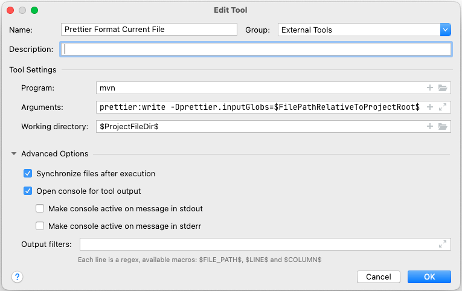

# Code Style

## Java

Java code is formatted by the **Eclipse JDT formatter**, run through the
[Spotless](https://github.com/diffplug/spotless) Maven plugin. The settings live in
`eclipse-formatter.properties` in the project root, and they format both the code and the content of
the Javadoc comments. A check is run in the CI build, which fails the build preventing merging a PR
if the code style is incorrect.

Up to and including OTP v2.11 the code was formatted with
[Prettier Java](https://github.com/jhipster/prettier-java). The Eclipse profile is tuned to
reproduce that style as closely as the Eclipse formatter allows - 100 character lines, 2 space
indentation, one argument per line when a call does not fit - so the everyday style is unchanged.
The remaining differences (mainly method chains, the "hugging" of a trailing lambda or anonymous
class, and a few tokens that Prettier adds and the Eclipse formatter cannot) are listed at the top
of `eclipse-formatter.properties`. Dropping Prettier for Java removed the `node`/`npm` dependency
from the Java build and made formatting the whole code base much faster.

Prettier is still used for the Markdown and JSON files, so `node` and `npm` must be available on the
`PATH` for those. The Prettier version and options are configured in the root `pom.xml`
(`prettier.version` and the Spotless plugin configuration).

In addition to formatting, Spotless removes unused imports from Java files. Imports that are only
referenced from Javadoc (for example `{@link Foo}`) are kept.

Additionally since OTP v2.9, we are using Checkstyle to check for code style issues with a Maven
plugin. There is also a checkstyle plugin for IntelliJ IDEA which can be used to spot and fix
issues. We also have an OpenRewrite Maven plugin available that can be used to automatically fix
some of the issues that are pointed out by Checkstyle. Comparison of different tools we considered
can be found in [#6913](https://github.com/opentripplanner/OpenTripPlanner/issues/6913).

### How to Use Checkstyle

Checkstyle can be configured to be in use in IntelliJ with
[a plugin](https://plugins.jetbrains.com/plugin/1065-checkstyle-idea). Additionally, we have
configured it to run by default as part of our Maven build. We also have OpenRewrite configured in
maven to fix some issues automatically, but it is not run by default as it takes a bit longer to
run.

Checkstyle will check for code style issues in the Maven "process-sources" phase, which runs after
the "validate" phase used by Spotless (so that Spotless can auto-fix issues like unused imports
first) and before the test, package, and install phases. So checkstyle will happen for example when
you run:

```shell
% mvn test
```

You can manually run _only_ the checkstyle with:

```shell
% mvn checkstyle:check
```

The check is run by the CI server and will fail the build if the code has code style issues.

To skip Checkstyle, use the profile `checkstyleSkip`:

```shell
% mvn test -P checkstyleSkip
```

OpenRewrite can be used to fix some of the checkstyle issues automatically. The following command
runs OpenRewrite and the formatter, but not checkstyle:

```shell
% mvn rewrite:run spotless:apply -P rewrite
```

### How to Run the Formatter

The formatter runs as part of a normal Maven build. It reformats the entire codebase, but only the
code you have changed should end up modified, since the existing code is already formatted. You can
also hook it into your IDE, so it runs every time a file is changed, see below.

The code is formatted automatically in the Maven "validate" phase, which runs before the test,
package, and install phases. So formatting will happen for example when you run:

```shell
% mvn test
```

You can manually run _only_ the formatting process with:

```shell
% mvn spotless:apply
```

To skip the formatting, use the profile `prettierSkip` (the profile and property names are unchanged
from when Prettier formatted the Java code):

```shell
% mvn test -P prettierSkip
```

To check for formatting errors, use the profile `prettierCheck`:

```shell
% mvn test -P prettierCheck
```

The check is run by the CI server and will fail the build if the code is incorrectly formatted.

### IntelliJ and Code Style Formatting

You should use Maven (`mvn spotless:apply`) to reformat the code, for example by setting it up as an
external tool, see below.

Spotless only formats the Java code and the Markdown and JSON files listed in its configuration. So
for other files you should use the _project_ code style. It is automatically imported when you first
open the project. But, if you have set a custom code style in your settings (as we used until OTP
v2.1), then you need to change to the _Project_ code style. Open the `Preferences` from the menu and
select _Editor > Code Style_. Then select **Project** in the \_Scheme drop down.

#### Run Spotless as an External Tool in IntelliJ

You can run Spotless as an external tool in IntelliJ. Set it up as an `External tool` and assign a
keyboard shortcut to the tool execution.



```text
Name:              Format Current File
Program:           mvn
Arguments:         spotless:apply -DspotlessFiles=$FilePathRelativeToProjectRoot$
Working Directory: $ProjectFileDir$
```

> **Tip!** Add an unused key shortcut to execute the external tool. Then you can use the old
> shortcut to format other file types.

#### Install File Watchers Plugin in IntelliJ

You can also configure IntelliJ to run the formatter every time IntelliJ saves a Java file. But if
you are editing the file at the same time, you will get a warning that the file in memory and the
file on disk both changed, and asked to select one of them.

1. In the menu, open _Preferences..._ and select _Plugins_.
2. Search for "File Watchers" in the Marketplace.
3. Run _Install_.

##### Configure File Watchers

You can run the formatter upon every file save in IntelliJ using the File Watchers plugin. Below is
how to configure it using Maven to run the formatter.

```text
Name:              Format files with Spotless
File Type:         Java
Scope:             Project Files
Program:           mvn
Arguments:         spotless:apply -DspotlessFiles=$FilePathRelativeToProjectRoot$
Working Directory: $ProjectFileDir$
```

### Other IDEs

We do not have support for other IDEs at the moment. If you use another editor and make one, please
feel free to share it.

### Sorting Class Members

Some of the classes in OTP have a lot of fields and methods. Keeping members sorted reduces merge
conflicts. Adding fields and methods to the end of the list will cause merge conflicts more often
than inserting methods and fields in an ordered list. Fields and methods can be sorted in "feature"
sections or alphabetically, but stick to it and respect it when adding new methods and fields.

The provided formatter will group class members in this order:

1. Getter and setter methods are kept together.
2. Overridden methods are kept together.
3. Dependent methods are sorted in breadth-first order.
4. Members are sorted like this:
   1. `static final` fields (constants)
   2. `static` fields (avoid)
   3. Instance fields
   4. Static initializers
   5. Class initializers
   6. Constructors
   7. `static` factory methods
   8. `public` methods
   9. Getter and setters
   10. `private`/package methods
   11. `private` enums (avoid `public`)
   12. Interfaces
   13. `private static` classes (avoid `public`)
   14. Instance classes (avoid)

### Javadoc Guidelines

As a matter of [policy](http://github.com/opentripplanner/OpenTripPlanner/issues/93), all new
methods, classes, and fields should include comments explaining what they are for and any other
pertinent information. For Java code, the comments should follow industry standards. It is best to
provide comments that explain not only _what_ you did but also _why you did it_ while providing some
context. Please avoid including trivial Javadoc or the empty Javadoc stubs added by IDEs, such as
`@param` annotations with no description.

- On methods:
  - Side effects on instance state (is it a pure function)
  - Contract of the method
    - Input domain for which the logic is designed
    - Range of outputs produced from valid inputs
    - Is behavior undefined or will the method fail when conditions are not met?
    - Are null values allowed as inputs?
    - Will null values occur as outputs (and what do they mean)?
  - Invariants that hold if the preconditions are met
  - Concurrency — document when it matters (see class-level guidance below)
- On classes:
  - Initialization and teardown process
  - Can an instance be reused for multiple operations, or should it be discarded?
  - Is it immutable, or should anything be treated as immutable?
  - Is it a utility class of static methods that should not be instantiated?
  - Concurrency — only document thread safety when it is relevant to callers:
    - Document that a class **is thread-safe** if it can safely be shared across threads (e.g.
      immutable, or uses proper internal synchronization).
    - Document that a class **is not thread-safe** if it could reasonably be used in a concurrent
      context but requires external synchronization.
    - Do **not** add `@NotThreadSafe` or a "not thread-safe" note to classes that live exclusively
      in a single-threaded context (e.g. Raptor worker state), where concurrent use is neither
      expected nor possible. Documenting the absence of something that was never a concern adds
      noise and can mislead readers.

### Annotations

- On methods:
  - Method should be marked as `@Nullable` if they can return null values.
  - Method parameters should be marked as `@Nullable` if they can take null values.
- On fields:
  - Fields should be marked as `@Nullable` if they are nullable.

Use of `@Nonnull` annotation is not allowed. It should be assumed methods/parameters/fields are
non-null if they are not marked as `@Nullable`. However, there are places where the `@Nullable`
annotation is missing even if it should have been used. Those can be updated to use the `@Nullable`
annotation.
