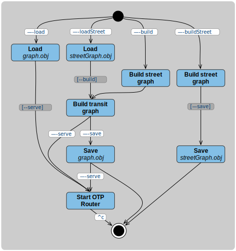

# OpenTripPlanner Basic Tutorial

This page should allow you to set up and test your own OTP2 server. If all goes well it should only
take a few minutes!

## Get Java

As a Java program, OTP must be run within a Java virtual machine (JVM), which is provided as part of
the Java runtime (JRE) or Java development kit (JDK). OTP2 is compatible with Java 21 or later. We
recommend running on Java 21 rather than a later version, as it is a long-term support release.
Run `java -version` to check that you have version 21 or newer of the JVM installed. If you do not,
you will need to install a recent OpenJDK or Oracle Java package for your operating system.

## Get OTP

OpenTripPlanner is written in Java and distributed as a single runnable JAR file. This is a "shaded"
JAR containing all other libraries needed for OTP to work, and is available from the Maven Central
repository. You will be able to go
to [the OTP directory at Maven Central](https://repo1.maven.org/maven2/org/opentripplanner/otp/),
navigate to
the [directory of releases](https://repo1.maven.org/maven2/org/opentripplanner/otp-shaded/2.8.0/),
and download
the [file with `otp-shaded` artifactId](https://repo1.maven.org/maven2/org/opentripplanner/otp-shaded/2.8.0/otp-shaded-2.8.0.jar)
.

You may also want to get your own copy of the OTP source code
and [build a bleeding edge development JAR from scratch](Getting-OTP.md), especially if you plan to
do some development yourself. In that case, check out the branch `dev-2.x`.

## Get some data

### GTFS for Transit Schedules and Stops

First you'll need GTFS data to build a transit network. There's an excellent description of the GTFS
format [here](http://gtfs.org/). Transport agencies throughout the world provide GTFS schedules to
the public. Transitland has a
[registry of feeds](https://transit.land/feed-registry) and [TransitFeeds](http://transitfeeds.com/)
also provides an extensive catalog. The best option is often to simply fetch the data directly from
a transit operator or agency. If you know of a feed you want to work with, download it and put it in
an empty directory you have created for your OTP instance such as `/home/username/otp` on
Linux, `/Users/username/otp` on MacOS, or `C:\Users\username\otp` on Windows. For OTP2 to detect a
GTFS file, **its name must end in `.zip` and must contain the letters 'gtfs'**. We often use the
convention of saving GTFS files with names ending in `.gtfs.zip` which meets both these criteria,
reflecting the fact that a GTFS feed is just a ZIP file containing a specific set of files. If you
don't have a particular feed in mind, the one for Portland, Oregon's TriMet agency is a good option.
It is available at [this URL](http://developer.trimet.org/schedule/gtfs.zip). This is a
moderate-sized input of good quality (TriMet initiated OTP development and helped develop the GTFS
format). On Linux, this could be done on the command line as follows:

    $ cd /home/username
    $ mkdir otp
    $ cd otp
    $ wget "http://developer.trimet.org/schedule/gtfs.zip" -O trimet.gtfs.zip

### OSM for Streets

You'll also need OpenStreetMap data to build a road network for walking, cycling, and
driving. [OpenStreetMap](https://www.openstreetmap.org/) is a global collaborative map database that
rivals or surpasses the quality of commercial maps in many locations. Several services extract
smaller geographic regions from this database. Interline Technologies maintains a collection
of [extracts updated daily for urban areas around the world](https://www.interline.io/osm/extracts/)
. [Geofabrik](http://download.geofabrik.de/) provides extracts for larger areas like countries or
states, from which you can prepare your own smaller bounding-box extracts
using [Osmosis](http://wiki.openstreetmap.org/wiki/Osmosis#Extracting_bounding_boxes)
, [osmconvert](http://wiki.openstreetmap.org/wiki/Osmconvert#Applying_Geographical_Borders), or (our
favorite) [Osmium-Tool](https://osmcode.org/osmium-tool/manual.html#creating-geographic-extracts).
There is also [Protomaps](https://app.protomaps.com/) which can create custom extracts 
for any region of the world with an easy to use drag and drop interface.
OSM data can be delivered as XML or in the more compact binary PBF format. OpenTripPlanner consumes
only PBF because it's smaller and more efficient.

Download OSM PBF data for the same geographic region as your GTFS feed, and place this PBF file in
the same directory you created for the OSM data. If you are using the TriMet GTFS feed, you could
download
the [Geofabrik extract for the US state of Oregon](http://download.geofabrik.de/north-america/us/oregon.html)
, then further trim that to just
the [TriMet service area](https://trimet.org/pdfs/taxinfo/trimetdistrictboundary.pdf) using the
bounding box switch of one of the above tools. On Linux or MacOS you could do that as follows:

    $ cd /home/username
    $ wget http://download.geofabrik.de/north-america/us/oregon-latest.osm.pbf
    $ osmconvert oregon-latest.osm.pbf -b=-123.043,45.246,-122.276,45.652 --complete-ways -o=portland.pbf
    $ mv portland.pbf otp

We find [this tool](https://boundingbox.klokantech.com/) useful for determining the geographic
coordinates of bounding boxes. The CSV option in that tool produces exactly the format expected by
the `osmconvert -b` switch. The `--complete-ways` switch is important to handle roads that cross
outside your bounding box.

If you have extracted a smaller PBF file from a larger region, be sure to put only your extract (not
the original larger file) in the directory with your GTFS data. Otherwise OTP will try to load both
the original file and the extract in a later step. See
the [page on preparing OSM data](Preparing-OSM.md) for additional information and example commands
for cropping and filtering OSM data.

## Starting OTP

A typical command to start OTP looks like `java -Xmx2G -jar otp-shaded-VERSION.jar <options>`. The
`-Xmx` parameter sets the limit on how much memory OTP is allowed to consume. GTFS and OSM data sets
are often very large, and OTP is relatively memory-hungry. You will need at least 1GB of memory when
working with the Portland TriMet data set, and several gigabytes for larger inputs.
[Here is more information about the system requirements](System-Requirements.md). If you have
sufficient memory in your computer, set this to a couple of gigabytes (e.g. `-Xmx2G`). Java uses
a [garbage collection](https://en.wikipedia.org/wiki/Garbage_collection_(computer_science)) approach
to memory management, which requires some "breathing room" to efficiently operate. Without
sufficient free memory OTP can grind to a halt. [VisualVM](https://visualvm.github.io) is a good way
to inspect Java memory usage, especially with
the [VisualGC plugin](https://visualvm.github.io/plugins.html).

## Building Graphs

There are two main phases to preparing and deploying an OTP server. The first is to analyze the
GTFS, OSM and any other inputs (such as elevation data) and build a representation of the
transportation network. Following mathematical terminology we call this
a ['graph'](http://en.wikipedia.org/wiki/Graph_%28mathematics%29), and refer to this phase as "graph
building". The second phase is to start a server that provides trip planning and other API services
for this graph.

It is possible to save the graph to a file on disk after the first phase, then load the graph from
the file in the second phase. This allows restarting the server or starting multiple instances of
the server without repeating the often time-consuming process of building the graph. It is also
possible to split the graph building process into separate OSM and GTFS stages for similar reasons:
to allow reusing results from slow processes, such as applying elevation data to streets. These
different options are controlled with command line switches, and will be described in more detail
below and in other tutorials.

## Simple One-step Server

The simplest way to use OTP is to build a graph in a single step and start a server immediately,
without saving it to disk. The command to do so is:

    $ java -Xmx2G -jar otp-shaded-2.8.0.jar --build --serve /home/username/otp

where `/home/username/otp` should be the directory where you put your configuration and input files.

If you're using the Portland input data, the graph build operation should take about one minute to
complete, and then you'll see a `Grizzly server running` message. At this point you have an
OpenTripPlanner server running locally and can open [http://localhost:8080/](http://localhost:8080/)
in a web browser. You should be presented with a Javascript client application that will interact
with your local OpenTripPlanner instance.

This map-based user interface is in fact sending HTTP GET requests to the OTP server running on your
local machine. It can be informative to watch the HTTP requests and responses being generated using
the developer tools in your web browser. OTP's built-in web server will run by default on port 8080.
If by any chance some other software is already using that port number, you can specify a different
port number with a switch
`--port 8801`.

## Saving a Graph

If you want speed up the process of repeatedly starting up a server with the same graph, you can
build a graph from street and transit data then save it to a file using the `--build` and `--save`
command line parameters together. If for example your current working directory (`.`) contains the
input files and the OTP JAR file, you can use this command:

    $ java -Xmx2G -jar otp-shaded-2.8.0.jar --build --save .

This will produce a file called `graph.obj` in the same directory as the inputs. The server can then
be started later using the `--load` parameter, and will read this file instead of building the graph
from scratch:

    $ java -Xmx2G -jar otp-shaded-2.8.0.jar --load .

Another reason to perform these two phases separately is that the building process loads the entire
GTFS and OSM data sets into memory, so can require significantly more memory than just running a
server. Accordingly, you may want to perform the build on one machine (e.g. a throw-away cloud
instance with more memory or compute capacity), then copy the resulting graph file to one or more
smaller machines to serve the API.

## Layering GTFS onto OSM

Building the street graph (especially with elevation data) can take a long time. It is common for
transit data to change more frequently than street data, so it can be convenient to build the street
graph once, and then layer transit data on top of the streets to make the final graph.

Again assuming the input files and OTP JAR file are in the current working directory, you can build
a street graph with OSM and elevation data only (ignoring transit input files) with this command:

    $ java -Xmx2G -jar otp-shaded-2.8.0.jar --buildStreet .

Then, to build a graph layering transit data on top of the saved street graph (built using the
previous command):

    $ java -Xmx2G -jar otp-shaded-2.8.0.jar --loadStreet --save .

Finally, the server can be started using the `--load` parameter:

    $ java -Xmx2G -jar otp-shaded-2.8.0.jar --load .

## Command Line Switches

The flow diagram below summarizes all the command line switches used in the above examples, and how
they control which actions are taken when OTP starts up.

You must use at least one of the required parameters: `--load`, `--loadStreet`, `--build`
, `--buildStreet`. A _required_ parameter may imply other parameters when the flow allows for no
other choice. For example, `--load` implies `--serve`, so `--serve` is not necessary and has no
additional effect when used together with `--load`.

You can run the OTP .jar file with the `--help` option for a full list of command line parameters.

## Exploring the API

If you want to learn how to use OTP's API's, check out the [GraphQL tutorial](apis/GraphQL-Tutorial.md).
