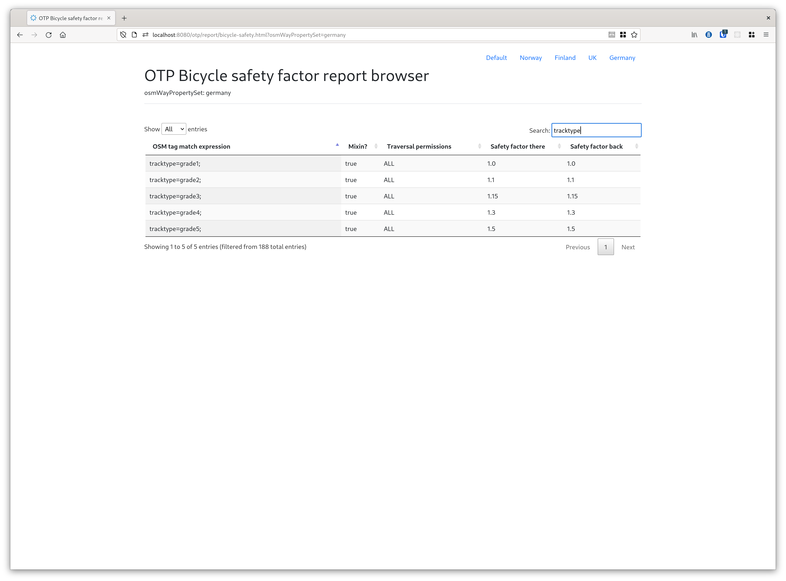

# Troubleshooting Routing

## Graph Builder Data Import Issues

When you build a graph, OTP may encounter clearly incorrect or ambiguous data, or may detect less
severe, but potentially problematic situations in the input data. Such problems should result in a
"Data Import Issue" being generated. These issues are logged the the `DATA_IMPORT_ISSUES` console
logger, depending on your need you might turn this logger on/off. At the end of the graph build
process, OTP prints a summary of all the issues, like the following:

```
 11:35:57.515 INFO (Graph.java:970) Summary (number of each type of issues):
 11:35:57.518 INFO (Graph.java:976)     TurnRestrictionBad - 560
 11:35:57.518 INFO (Graph.java:976)     TurnRestrictionException - 15
 11:35:57.518 INFO (Graph.java:976)     StopLinkedTooFar - 22
 11:35:57.518 INFO (Graph.java:976)     HopSpeedSlow - 22
 11:35:57.518 INFO (Graph.java:976)     Graphwide - 1
 11:35:57.518 INFO (Graph.java:976)     GraphConnectivity - 407
 11:35:57.519 INFO (Graph.java:976)     ParkAndRideUnlinked - 1
 11:35:57.519 INFO (Graph.java:976)     StopNotLinkedForTransfers - 31
 11:35:57.519 INFO (Graph.java:976)     NoFutureDates - 1
```

The full set of issues can be written out to an HTML report for closer inspection. To enable the
creation of these (potentially voluminous) HTML reports, add `"dataImportReport" : true` to your
graph builder JSON configuration.

If the graph is saved to a file, these issues are saved with it and can be examined later. Currently
the only tool for doing this is the "Graph Visualizer", which is not particularly well maintained
and is intended for use by software developers familiar with OTP who can patch up the code as
needed.

## OpenStreetMap Data

### Tags affecting permissions and bicycle safety

OTP has a very flexible system for deciding when a street is to be allowed by pedestrians, bicycles
or cars.

To configure the which settings to use for your location, please use
the [osmTagMapping config attribute](BuildConfiguration.md#Osm-Tag-Mapping).

In the following section we will discuss the default case, which will be used if the property is not
set.

### Default settings

Access tags (such as bicycle/foot = yes/no/designated) can be used to override default
graph-building parameters.

As a default, foot and bicycle traffic is ''not'' allowed on `highway=trunk`, `highway=trunk_link`
, `highway=motorway`, `highway=motorway_link`, or `highway=construction`.

Both *are* allowed on `highway=pedestrian`, `highway=cycleway`, and `highway=footway`.

Finally, bicycles are *not* allowed on *highway=footway* when any of the following tags appear on a
footway: `footway=sidewalk`, `public_transport=platform`, or `railway=platform`.

Other access tags (such as `access=no` and `access=private` affect routing as well, and can be
overridden similarly. While `access=no` prohibits all traffic, `access=private` disallows through
traffic.

### Bicycle safety factor

Bicycle routing is even more configurable than the other traverse modes: during graph build a
so-called bicycle safety score is computed for each street. You can think of this score as a penalty
for traversing this way so the lower the score the better.

For example if a way is tagged with `surface=sand` it receives a safety score of 100 which means
that it's 100 times worse to cycle on when compared to a way which has a safety score of 1.

How this is calculated depends on two things

- the incline of the way (not read from OSM but from
  the [separately configured elevation data](Configuration.md#Elevation data))
- its OSM tags

At request time you can then use the `triangleFactors` to decide how important bicycle safety is
compared to shorter distances and flatness.

Each `WayPropertySet` contains rules for a given set of tag matchers that influence the bicycle
safety score. For example, a rule looks like this:

```java
props.setProperties("highway=track", StreetTraversalPermission.ALL, 1.3, 1.3);
```

This means that an OSM way with the tag `highway=track` is traversable by all modes (pedestrian,
bicycle, car) and that its bicycle safety score when you traverse in order of the way is `1.3` and
also `1.3` when going the other way
(smaller means more cycle-friendly).

If there is a more specific matcher like `highway=track;bicycle=no` and it matches a given OSM way,
it is chosen instead and its settings applied.

The score can be any positive number but the range (as of writing this) goes from `0.6` for bike
lanes to `100` for ways that consist of sand. To figure out a good value for your set of tags you
should read the bicycle safety report (see below) or the source code of your `OsmTagMapper`
to get a feeling for how much certain tags are penalised or rewarded.

There are also so-called mixins. These are applied on top of the most specific matchers and a single
OSM way can match many mixins. The mixins' safety values are multiplied with the value of the base
(non-mixin) match. A mixin looks like this (note the `true` at the end):

```java
props.setProperties("surface=mud", StreetTraversalPermission.ALL, 1.5, 1.5, true);
```

The Javadoc
of [`OSMSpecifier.java`](https://github.com/opentripplanner/OpenTripPlanner/blob/dev-2.x/application/src/main/java/org/opentripplanner/osm/wayproperty/specifier/OsmSpecifier.java)
contains the precise documentation about the syntax of the matchers.

There are a lot of rules for which tags results in a specific safety score so it's not easy to get
an overview. There is however an OTP feature to get an HTML viewer with a search feature that lets
you browse through the rules.



To enable it activate the [Report API sandbox feature](sandbox/ReportApi.md).

### Railway Platforms

OTP users in Helsinki have documented their best practices for coding railway platforms in
OpenStreetMap. These guidelines are
available [in the OSM Wiki.](https://wiki.openstreetmap.org/wiki/Digitransit#Editing_railway_platforms)


### Transit search

The Raptor implementation support instrumentation of ACCEPT, REJECT, and DROP events for
stop-arrivals and trip boardings. Use the SpeedTest to pass in a set of stops and/or a specific path
to debug. This is useful when debugging why you do (not) get a particular result.

Read the [logging page](Logging.md) for more information.

### GTFS Transfers.txt and NeTEx Interchange import

Transfers may have effects on the routing which may be difficult to predict. OTP can dump all
imported transfers to file - _transfers-debug.csv_. This may help verify the result of the import or
find special test cases. To turn on the export enable the slf4j logger:

```
  <logger name="TRANSFERS_EXPORT" level="info" />
```

### Further information

* [General information](https://github.com/opentripplanner/OpenTripPlanner/wiki/GraphBuilder#graph-concepts)
* [Bicycle routing](http://wiki.openstreetmap.org/wiki/OpenTripPlanner#Bicycle_routing)
* [Indoor mapping](https://github.com/opentripplanner/OpenTripPlanner/wiki/Indoor-mapping)
* [Elevators](http://wiki.openstreetmap.org/wiki/OpenTripPlanner#Elevators)
