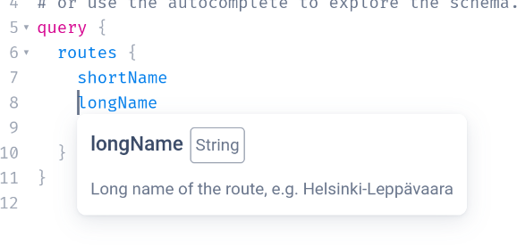

<!--
  NOTE! Part of this document is generated. Make sure you edit the template, not the generated doc.

   - Template directory is:  /doc/templates
   - Generated directory is: /doc/user 
-->

# GraphQL tutorial

This document will give you a quick start tutorial on how to get started with OTP's GraphQL APIs. For 
this tutorial we will be using the [GTFS GraphQL API](GTFS-GraphQL-API.md) as this is the most commonly used one.

First of all, make sure that you've loaded street and transit data into your instance by following
the [basic tutorial](../Basic-Tutorial.md)

## Visual GraphQL API client

OTP has a built-in API client to help you build queries and view documentation. After having
started OTP, visit [http://localhost:8080/graphiql](http://localhost:8080/graphiql) to open it.

It should look like this:


## Sending your first query

For our first query we want to get the list of routes loaded into OTP. Therefore paste the following 
GraphQL query in the left hand panel of the page:

<!-- route-query BEGIN -->
<!-- NOTE! This section is auto-generated. Do not change, change doc in code instead. -->

```graphql
{
  routes {
    longName
    shortName
    gtfsId
    agency {
      gtfsId
      name
    }
    mode
  }
}

```

<!-- route-query END -->

After pressing the "Execute query" button you should see the result of the query on the right hand
side panel.

Now would be a good time to explore the auto-complete capabilities of the tool by moving the
cursor into the query panel and hitting Ctrl-Space to see what other query parameters are possible.


The explorer also has documentation built into it. If you hover your pointer over a property on the 
left hand side you can see its documentation.



## A more advanced query

Most people want to get routing results out of OTP, so lets see the query for this:

<!-- plan-query BEGIN -->
<!-- NOTE! This section is auto-generated. Do not change, change doc in code instead. -->

```graphql
{
  planConnection(
    origin: {
      # these coordinates are in Portland, change this to YOUR origin
      location: { coordinate: { latitude: 45.5552, longitude: -122.6534 } }
    }
    destination: {
      # these coordinates are in Portland, change this to YOUR destination
      location: { coordinate: { latitude: 45.4908, longitude: -122.5519 } }
    }
    # use the correct date and time of your request
    dateTime: { earliestDeparture: "2023-06-13T14:30-07:00" }
    # choose the transport modes you need
    modes: {
      direct: [WALK]
      transit: { transit: [{ mode: BUS }, { mode: RAIL }] }
    }
  ) {
    edges {
      node {
        start
        end
        legs {
          mode
          from {
            name
            lat
            lon
            departure {
              scheduledTime
              estimated {
                time
                delay
              }
            }
          }
          to {
            name
            lat
            lon
            arrival {
              scheduledTime
              estimated {
                time
                delay
              }
            }
          }
          route {
            gtfsId
            longName
            shortName
          }
          legGeometry {
            points
          }
        }
      }
    }
  }
}

```

<!-- plan-query END -->

Again, please use the autocomplete and documentation viewers to figure out what each input parameter
and property means.

More examples for a variety of queries can also be found [in the test code](https://github.com/opentripplanner/OpenTripPlanner/tree/dev-2.x/application/src/test/resources/org/opentripplanner/apis/gtfs/queries).