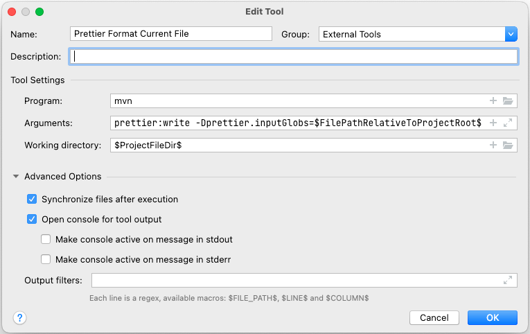

# Codestyle

We use the following code conventions for [Java](#Java) and [JavaScript](#JavaScript).

## Java

The OpenTripPlanner Java code style is revised in OTP v2.2. We use the
[Prettier Java](https://github.com/jhipster/prettier-java) as is. Maven is setup to
run `prettier-maven-plugin`. A check is run in the CI build, which fails the build preventing
merging a PR if the code-style is incorrect.

There is two ways to format the code before checkin it in. You may run a normal build with maven -
it takes a bit of time, but reformat the entire codebase. Only code you have changed should be
formatted, since the existing code is already formatted. The second way is to set up prettier and
run it manually or hick it into your IDE, so it runs every time a file is changed.

### How to run Prettier with Maven

Prettier will automatically format all code in the Maven "validate" phase, which runs before the test, package, and install phases. So formatting will happen for example when you run:

```
% mvn test
```

You can manually run _only_ the formatting process with:

```
% mvn prettier:write

```

To skip the prettier formating use profile `prettierSkip`:

```
% mvn test -P prettierSkip
```

The check for formatting errors use profile `prettierCheck`:

```
% mvn test -P prettierCheck
```

The check is run by the CI server and will fail the build if the code is incorrectly formatted.

### IntellJ and Code Style Formatting

You should use the prettier Maven plugin to reformat the code or run prettier with Node(faster).

The prettier does NOT format the doc and markdown files, only Java code. So, for other files you should
use the _project_ code-style. It is automatically imported when you first open the project. But, if
you have set a custom code-style in your settings (as we used until OTP v2.1), then you need to
change to the _Project_ Code Style. Open the `Preferences` from the menu and select _
Editor > Code Style_. Then select **Project** in the \_Scheme drop down.

#### Run Prettier Maven Plugin as an external tool in IntelliJ

You can run the Prettier Maven plugin as an external tool in IntelliJ. Set it up as an
`External tool` and assign a key-shortcut to the tool execution.



```
Name:              Prettier Format Current File
Program:           mvn
Arguments:         prettier:write -Dprettier.inputGlobs=$FilePathRelativeToProjectRoot$
Working Directory: $ProjectFileDir$
```
> **Tip!**  Add a unused key shortcut to execute the external tool, then you can use the old 
> short-cut to format other file types.


#### Install File Watchers Plugin in IntelliJ

You can also configure IntelliJ to run the prettier every time IntelliJ save a Java file. But,
if you are editing the file at the same time you will get a warning that the file in memory and the
file on disk both changed - and asked to select one of them.

1. In the menyopen _Prefernces..._ and select _Plugins_.
2. Search for "File Watchers" in Marketplace
3. Run _Install_

##### Configure File Watcher

You can run Prettier on every file save in Intellij using the File Watcher plugin. There is several
ways to set it up. Below is hwo to configure it using Maven to run the formatter. The Maven way work
without any installation of other components, but might be a bit slow. So, you might want to install
[prettier-java](https://github.com/jhipster/prettier-java/) in your shell and run it instead.

```
Name:              Format files with Prettier
File type:         Java
Scope:             Project Files
Program:           mvn
Arguments:         prettier:write -Dprettier.inputGlobs=$FilePathRelativeToProjectRoot$
Working Directory: $ProjectFileDir$
```

### Other IDEs

We do not have support for other IDEs at the moment. If you use another editor and make one please
feel free to share it.

### Sorting Class Members

Some of the classes in OTP have a lot of fields and methods. Keeping members sorted reduce the merge
conflicts. Adding fields and methods to the end of the list will cause merge conflicts more often
than inserting methods and fields in an ordered list. Fields and methods can be sorted in "feature"
sections or alphabetically, but stick to it and respect it when adding new methods and fields.

The provided formatter will group class members in this order:

1. Getter and Setter methods are kept together
2. Overridden methods are kept together
3. Dependent methods are sorted in a breadth-first order.
4. Members are sorted like this:
    1. `static` `final` fields
    2. `static` fields
    3. `static` initializer
    4. `final` fields
    5. fields
    6. class initializer (avoid using it)
    7. Constructor
    8. `static` methods
    9. `static` getter and setters
    10. methods
    11. getter and setters
    12. enums
    13. interfaces
    14. `static` classes
    15. classes
5. Each section of members are sorted by visibility:
    1. ´public´
    2. package private
    3. ´protected´
    4. ´private´

### JavaDoc Guidlines

What to put in Javadoc:

- On methods:
    - Side effects on instance state (is it a pure function)
    - Contract of the method
        - Input domain for which the logic is designed
        - Range of outputs produced from valid inputs
        - Is behavior undefined or will fail when conditions are not met
        - Are null values allowed as inputs
        - Will null values occur as outputs (what do they mean)
    - Invariants that hold if the preconditions are met
    - Concurrency
        - Is method thread-safe
        - Usage constraints for multi-threaded use
- On classes:
    - Initialization and teardown process
    - Can instance be reused for multiple operations, or should it be discarded
    - Is it immutable or should anything be treated as immutable
    - Is it a utility class of static methods that should not be instantiated

## JavaScript

As of #206, we
follow [Crockford's JavaScript code conventions](http://javascript.crockford.com/code.html). Further
guidelines include:

* All .js source files should contain one class only
* Capitalize the class name, as well as the source file name (a la Java)
* Include the namespace definition in each and every file: `otp.namespace("otp.configure");`
* Include a class comment. For example,

```javascript
/**
 * Configure Class
 *
 * Purpose is to allow a generic configuration object to be read via AJAX/JSON, and inserted into an
 * Ext Store
 * The implementation is TriMet route map specific...but replacing ConfigureStore object (or member
 * variables) with another implementation, will give this widget flexibility for other uses beyond
 * the iMap.
 *
 * @class
 */
```

> **Note:** There is still a lot of code following other style conventions, but please adhere to
> consistent style when you write new code, and help clean up and reformat code as you refactor.
