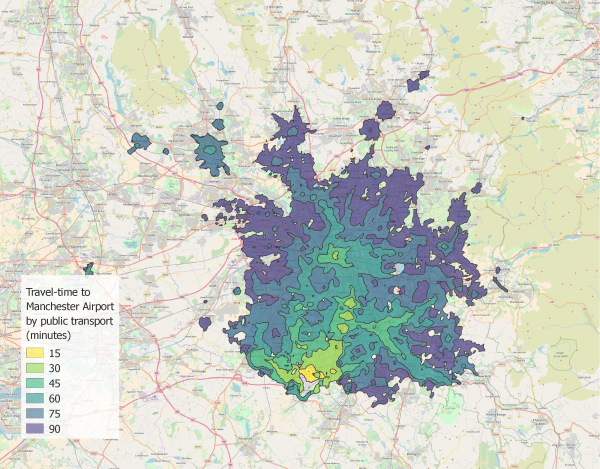

# Intermediate Usage of OpenTripPlanner
This page follows up on [basic usage](Basic-Usage.md) with more detailed examples of OpenTripPlanner functionality. It is not an exhaustive list but should serve to demonstrate some useful applications. 

## Using the web API to plan a transit trip
One of the most important ways that OpenTripPlanner is used is, of course, the planning of trips. You can use the API to request an itinerary from one place to another at a particular time:

[`http://localhost:8080/otp/routers/default/plan?fromPlace=43.637,-79.434&toPlace=43.646,-79.388&time=1:02pm&date=11-14-2017&mode=TRANSIT,WALK&maxWalkDistance=500&arriveBy=false`](http://localhost:8080/otp/routers/default/plan?fromPlace=43.637,-79.434&toPlace=43.646,-79.388&time=1:02pm&date=11-14-2017&mode=TRANSIT,WALK&maxWalkDistance=500&arriveBy=false)

The above query makes a request to the locally running server `http://localhost:8080/`, requesting the [planner resource](http://dev.opentripplanner.org/apidoc/1.4.0/resource_PlannerResource.html) `...otp/routers/default/plan`, and passes the following parameters:

- **fromPlace=43.637,-79.434**, the origin of the trip, in latitude, longitude
- **toPlace=43.646,-79.388**, the destination of the trip
- **time=1:02pm**, the desired departure time
- **date=**, the desired departure date
- **arriveBy=false**, specifies that the given time is when we plan to depart rather than when we want to arrive
- **mode=TRANSIT,WALK**, transport modes to consider, in this case a combination of walking and transit
- **maxWalkDistance=500**, the maximum distance in meters that you are willing to walk

If you run this query as is you will very likely get a response saying that a trip has not been found. Try changing the fromPlace, toPlace, time and date parameters to match the location and time period of the data you loaded when you initially built the graph. More (optional) parameters for the planner resource are documented [here](http://dev.opentripplanner.org/apidoc/1.4.0/resource_PlannerResource.html). 

## Calculating travel time isochrones
OpenTripPlanner can also be used to calculate the area which is accessible from a point within a given travel time, also known as a travel time isochrone. 

(_Image courtesy of [marcusyoung](https://github.com/marcusyoung)_)

Here we'll use of the [LIsochrone resource](http://dev.opentripplanner.org/apidoc/1.4.0/resource_LIsochrone.html) in the following query:

[`http://localhost:8080/otp/routers/ttc/isochrone?fromPlace=43.637,-79.434&mode=WALK,TRANSIT&date=11-14-2017&time=8:00am&maxWalkDistance=500&cutoffSec=1800&cutoffSec=3600`](http://localhost:8080/otp/routers/ttc/isochrone?fromPlace=43.637,-79.434&mode=WALK,TRANSIT&date=11-14-2017&time=8:00am&maxWalkDistance=500&cutoffSec=1800&cutoffSec=3600)

Many of the parameters in this GET request should be familiar from the last example, though a few new ones have been added.

- **fromPlace=43.637,-79.434** is our origin location in latitude,longitude
- **cutoffSec=1800** tells the router that we want an isochrone ending at a half hour (1800 seconds) travel from the origin
- **cutoffSec=3600** the second (optional) specification of this parameter means that we'll get a second result, this time one hour (3600 seconds) from the origin
- **cutoffSec=...** this argument can be passed any number of times with diferent values. 

The result of the above query, if all goes well, is a geoJSON file with two multipolygons showing the area accessible within both one and one-half hour. Take a look at the [LIsochrone resource](http://dev.opentripplanner.org/apidoc/1.4.0/resource_LIsochrone.html) page for additional options. 

## Additional resources and documentation
See the [configuration](Configuration.md) page for configuration settings which effect either the router instance or the graph building process (e.g. fare settings, elevation models, request logging, transfer settings, etc.). 

It may also be helpful to try running the OTP .jar file with the `--help` option for a full list of command line parameters. 

Full documentation for the API is available [here](http://dev.opentripplanner.org/apidoc/1.4.0/index.html#resources).
