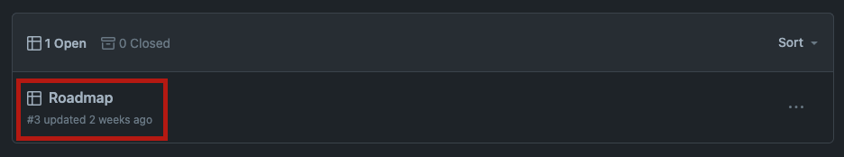
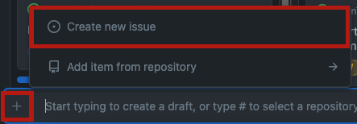
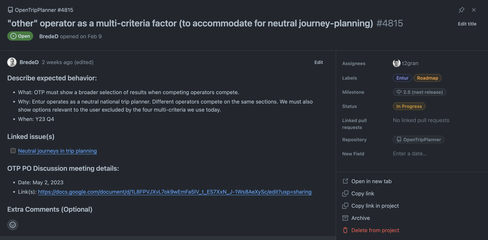

The OTP community uses a GitHub-hosted Roadmap to document all long-term feature requests for OpenTripPlanner. Unlike typical [OTP Issues](https://github.com/opentripplanner/OpenTripPlanner/issues), the Roadmap outlines quarterly and yearly product-focused goals the community intends to propose for OTP, rather than short-term bug fixes or feature requests.

Twice a year, product owners (POs) and developers will review and clean up the issues at the PO meetings. Product owner (PO) meetings are open to everyone interested in OTP and are held on the first Tuesday of each month at 7 AM US Pacific / 10 AM  US Eastern / 4PM CET. To join, please consult this [calender](https://calendar.google.com/calendar/u/0/embed?src=ormbltvsqb6adl80ejgudt0glc@group.calendar.google.com). For other questions, please contact members in the [Gitter](https://app.gitter.im/#/room/#opentripplanner_OpenTripPlanner:gitter.im) chat or the [user mailing list](https://groups.google.com/g/opentripplanner-users).

To create an issue on the OTP Roadmap, follow these steps:

1. Navigate to the [OpenTripPlanner GitHub](https://github.com/opentripplanner/OpenTripPlanner).
2. Select the "Projects" tab.
   
3. Choose the "Roadmap" project.
   
4. To add an issue, click "Add item" under the "Wish list" column.  
   
5. Click the "+" icon, then "Create a new issue." 
   
6. Select the "Roadmap Epic" type by clicking "Choose."
   
7. Complete the required fields:
    - What: Clearly state the desired changes or new features.
    - Why: Clearly state the expected impact or outcome of these changes.
    - When: Provide a timeline or timeframe for implementing these changes.
    - Link issue(s) related to or part of yours.
    - Use labels to indicate which organizations have an interest in this Roadmap issue or to classify the Issue.

    

Then, click "Create."

This is what your completed Roadmap Issue should like:

Discussions about the Issue within the corresponding [Gitter](https://app.gitter.im/#/room/#opentripplanner_OpenTripPlanner:gitter.im) chat are encouraged, along with participation in the OTP product owner (PO) or developer meetings.