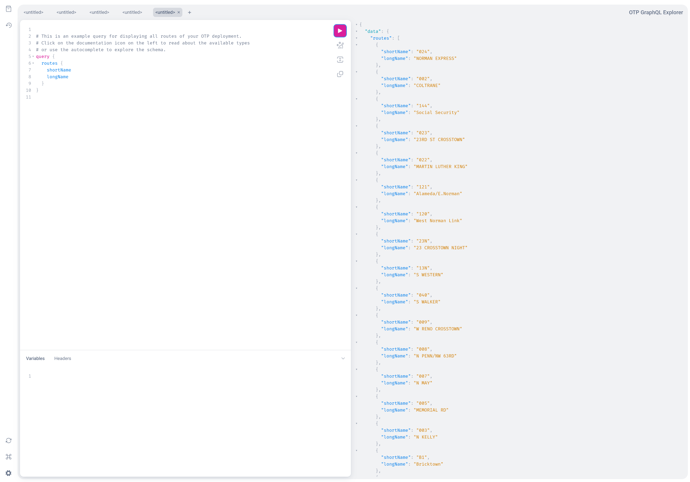

# GTFS GraphQL API

The GTFS GraphQL API is a general purpose API which was created for the Digitransit project and is 
used heavily by [digitransit-ui](https://github.com/HSLdevcom/digitransit-ui).

[otp-react-redux](https://github.com/opentripplanner/otp-react-redux) has also migrated to this API in 2023.

There is also a [Java client](https://github.com/opentripplanner/otp-java-client) available which
makes it easy to use this API in a Java application.

## URLs 
 - GraphQL endpoint: [`http://localhost:8080/otp/gtfs/v1`](http://localhost:8080/otp/gtfs/v1)
 - HTML schema documentation: [https://docs.opentripplanner.org/api/dev-2.x/graphql-gtfs/](https://docs.opentripplanner.org/api/dev-2.x/graphql-gtfs/)
 - Built-in visual GraphQL client: [http://localhost:8080/graphiql](http://localhost:8080/graphiql)

## Built-in API client

A browser based GraphQL API client is available at [http://localhost:8080/graphiql](http://localhost:8080/graphiql)



**`curl` example**

A complete example that fetches the list of all stops from OTP is:

```
curl --request POST \
  --url http://localhost:8080/otp/gtfs/v1 \
  --header 'Content-Type: application/json' \
  --header 'OTPTimeout: 180000' \
  --data '{"query":"query stops {\n  stops {\n    gtfsId\n    name\n  }\n}\n","operationName":"stops"}'
```
## Configuration

The API is enabled by default.

If you want to disable it, do it in `otp-config.json`:

```json
// otp-config.json
{
  "otpFeatures" : {
    "GtfsGraphQlApi": false
  }
}
```