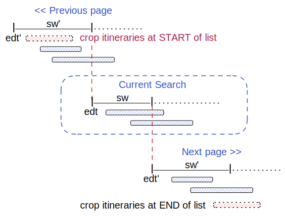
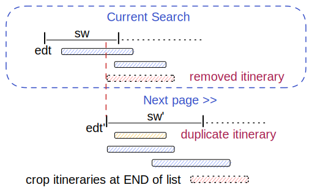
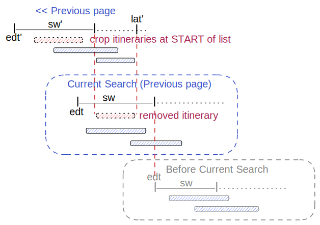
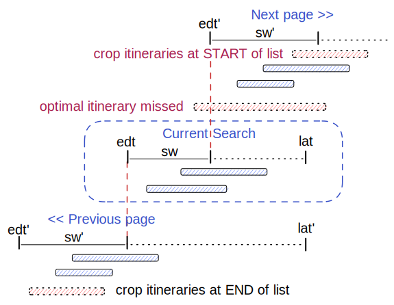
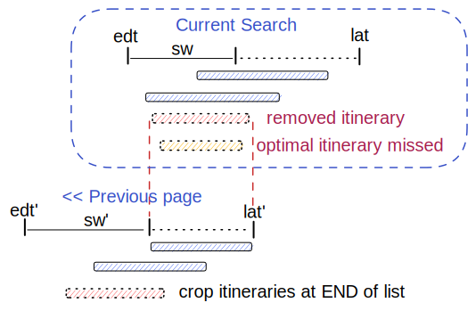
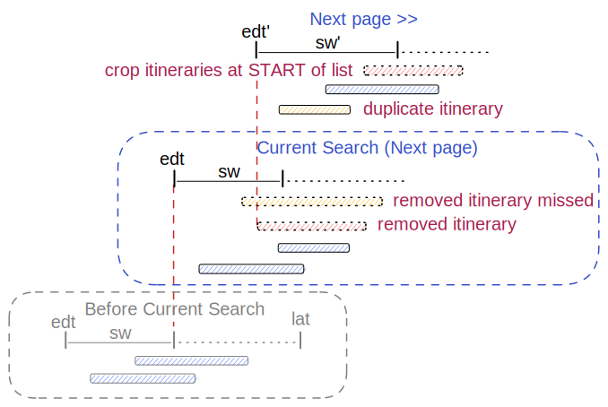

# Page Cursor Design

There are a few corner cases which complicates the paging. Below we have tried to document these
cases and at the same time illustrate how we have solved the different cases. There are also a few
cases which are not handled by the current implementation and we try to document those as well.

Each case is given a name and the name is referenced in code and unit tests.

We start with the most common "normal" case, and step into more complicated cases below. In the
discussion of each case we "build" on top of the previous ones - we try not to repeat the same
discussions - so read the cases in chronological order and make sure you understand each case before
moving on to the next.

## Terminology

- **search-window (sw)**  The search window is the minutes Raptor iterate over and the time-window
  the itinerary must start within to be included in the result. The search-window may change from a
  request to the next page.  **sw'** is the search window for the new next/previous page. The search
  window may change between requests, so we need to account for it when computing the next/previous
  page cursors.
- **earliest-departure-time (edt)**  The search-window start with the earliest-departure-time, which
  is the first possible time any itinerary may start. **edt'** is the calculated value for the new
  cursor.
- **latest-arrival-time (lat)**  The latest time an itinerary can arrive to get accepted. The
  latest-arrival-time is only used in _arrive-by_ search. **lat'** is the calculated value for the
  new cursor.
- **next page >>**  The trip search constructed to retrieve itineraries BEFORE the original search.
- **<< previous page**  The trip search constructed to retrieve itineraries AFTER the original
  search.
- **crop-search-window** If the `maxNumOfItineraries` limit is reached in the
  `ItineraryFilterChain`, then one or more itineraries are removed. The filter remove itineraries
  from the beginning or end of the list depending on the page cursor type (next/previous) and the
  sort order(arrival/departure time).

## Sort by arrival time (depart after)

The next 4 cases are all **depart after** trip routing requests. A _sort-by-arrival-time_ request
must have a _search-window(sw)_ and a _earliest-arrival-time_, but no _latest-arrival-time_.

### sort-by-arrival

This is the most common case, where itineraries returned are sorted by the arrival time with the
earliest arrival first. The regular depart after search with all itineraries departing inside the
search-window matches this case. The list of itineraries is _not_ cropped in the ItineraryFilter.

This case is straight forward to implement, the only thing to remember here is that the
_previous-page_ must reverse the itinerary-filtering: `crop itineraries at START of list`.

### sort-by-arrival & crop-search-window

- In this case the `<< Previous page` is the same as in [sort-by-arrival](#sort-by-arrival) and not
  shown.
- For the `Next page >>` we must adjust the `edt'`.
- In rare cases we get duplicate itineraries. This happens if the `removed itinerary` depart before,
  but arrive after the `duplicate`.

### sort-by-arrival, crop-search-window & original-prev-page

This is the most complicated case of the _sort-by-arrival_ search. It combines all cases above.

- The `Next page >>` is not shown since it is the same as in [sort-by-arrival](#sort-by-arrival).
- For `<< Previous page` we need to adjust the `edt'` and the `lat'` using the first removed
  itinerary.

## Sort by departure time (arrive by)

The next 4 cases are all **arrive by** trip routing requests. A _sort-by-departure-time_ is sorted
with the latest departure first (descending). The request must have a _search-window(sw)_ and a _
latest-arrival-time_. It is not possible to set the _earliest-departure-time_ in the request, but we
put it in the _pageCursor_ to avoid a new calculation for it in the next page/request.

### sort-by-departure

This is the basic `sort-by-departure` (arrive-by search) without removing itineraries in the
`ItineraryFilterChain`.

- The `<< Previous page` is straight forward to implement and any removal of itineraries in the
  `ItineraryFilterChain` will follow the same logic that the `Original Search`. Note! the
  `latest-arrival-time` is kept the same as in the `Original Search`.
- The `Next page >>` is a bit problematic, but a rare use-case.
    - Itineraries which start in the original search-window, but arrive AFTER the
      `latest-arrival-time` are not be found. Hopefully these cases are rare.
    - The sort order and filtering is reversed in the `ItineraryFilterChain`
      (`crop itineraries at START of list`).
    - The `latest-arrival-time` can not be computed and is dropped.

### sort-by-departure & crop-search-window

In this case the itineraries are dropped from the search results in the `Original Search` and the
`<< Previous page` must be adjusted. We use the first removed itinerary to set both the `edt'` and
the `lat'`. An `optimal itinarary` in the original search is lost (not found) in the previous page
if it departs AFTER the `remoed itinerary` and arrive before - hopefully this is a rare case.

The `Next page >>` is the same as the basic case [sort-by-departure](#sort-by-departure).

### sort-by-departure, crop-search-window & original-next-page

- The `<< Previous page` work the same as [sort-by-departure](#sort-by-departure)
- The `Next page >>` need to be adjusted by setting the `edt'` to the `removed itinerary`
  departure time.
    - We might have duplicate results, and we might lose some optimal results.
