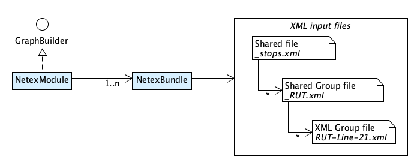

# NeTEx

NeTEx is a European standard for exchanging Transit data. OTP can import NeTEx into its 
internal model. The XML parser support the entire NeTEx specification and is not limited
to a specific profile, but not every part is mapped into OTP. Only a small subset of the 
entities are supported. When loading NeTEx data OTP should print warnings for all 
NeTEx data types not loaded.

OTP is tested with data from Entur witch uses the [Nordic NeTEx profile](https://enturas.atlassian.net/wiki/spaces/PUBLIC/pages/728891481/Nordic+NeTEx+Profile). If you find that some part of your import is not 
imported/supported by OTP you will need to add support for it in this model. NeTEx is huge, and
ONLY data relevant for travel planning should be imported. 

OTP assume the data is valid and as a main rule the data is not washed or improved inside OTP. Poor
data quality should be fixed BEFORE loading the data into OTP. OTP will try to _ignores_ invalid 
data, allowing the rest to be imported. 

## Design

The 2 main classes are the [`NetexModule`](NetexModule.java) and the [`NetexBundle`](NetexBundle.java).
The `NetexModule` is a `GraphBuilderModule` and responsible for building all bundles, while a bundle 
is responsible for importing a Netex bundle, normally a zip-file with a Netex data set. You may 
start OTP with as many bundles as you like, and you may mix GTFS and NeTEx bundles in the same build. 

### Netex File Bundle

As seen above the _netex-file-bundle_ is organized in a hierarchy. This is done to support 
loading large data set, and to avoid keeping everything in memory. OTP load entities into the a
hierarchical [`NetexEntityDataIndex`](index/NetexEntityDataIndex.java) before each entity is mapped.
This make sure all entities are available during mapping, and that the order of the entities in the 
files does not matter. 

The shared data si available during the entire mapping process. Then _group data_ is kept in memory 
for the duration of _parsing_ and _mapping_ each group. Data in one group is not visible to another
group.
 
Within each group there is also _shared-group-data_ and _group-files_ (leaf-files). 

- Entities in _group-files_ can reference other entities in the same file and entities in the 
  _shared-group-files_ and in the global _shared-files_, but not entities in other _group-files_.
- Entities in _shared-group-files_ can reference other entities in the same file and entities in 
  the same group of _hared-group-files_ and in the global _shared-files_, but not entities in any
   _group-files_.
- Entities in global _shared-files_ can reference other entities in the same file and entities in 
  other global _shared-files_.

✅ Note! You can configure how your data files are grouped into the 3 levels above using regular 
expressions in the _build-config.json_.

### Load entities and map to OTP model

The [load](loader/NetexDataSourceHierarchy.java), [validate](validation/Validator.java) and 
[mapping](mapping/NetexMapper.java) process is:

1. Load _shared-data-files_ into _index_.
1. Validate loaded entities 
1. Map _shared-data-entries_
1. For each group:
    1. Load _group-shared-files_ into index
    1. Validate loaded entities 
    1. Map _group-shared-entries_
    1. For each leaf group-file file:
        1. Load _group-file_ into index
        1. Validate loaded entities 
        1. Map _group-entries_
        1. Clear leaf data from index
    1. Clear group data from index

The [`NetexBundele`](NetexBundle.java) repeat the exact same steps at each level multiple times. 
The hierarchical structure of the file input is matched by the 
[`NetexEntityDataIndex`](index/NetexEntityDataIndex.java) and the 
[NetexMapper](mapping/NetexMapper.java). These two classes work like a "Stack" and provide `push()` 
and `pop()` methods to prepare/edject for each file set at a given level. 

## Dependencies
> TODO OTP2 - DSJ-3 Add this section when adding support for DSJ
