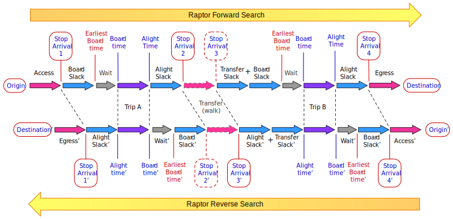

# Goal - Why replace AStar with Raptor?

We want to make the transit routing in OTP faster and at the same time better by changing from the
existing A* (AStar) to a Raptor based algorithm. We want to keep all existing features or replace
them with something at least as good. Some of the benefits are:

- faster travel search (our goal is at least 10 times faster)
- more and better variation in the result. We want true support for multi-criteria search (arrival
  time, transfers, travel duration, operator, weight/cost ...)

Changing the algorithm also mean that we will create a new data structure representing transit
service which is optimized for Raptor. The existing routing graph will be used for the _non_
transit search, but transit data will be removed from that existing graph.

# Terminology

The *Raptor* algorithm is described
in [a paper](https://www.microsoft.com/en-us/research/wp-content/uploads/2012/01/raptor_alenex.pdf)
by Microsoft from 2012. We plan to use the _Range Raptor_ with _Multi-criteria pareto-optimal_
search.

## Raptor

Raptor is a graph algorithm that works in _rounds_. The search starts from a list of access stops
and arrival times (initial _stop-arrivals_). Then for each _route_ serving these stops the best trip
is explored. Each _trip_ will take you to a new set of _stops_ with new _stop-arrivals_. Then
transfers from all stops reached are used to further reach new stops. This process is repeated, each
iteration of transit and transfers is called a _round_. For every _round_ a new list of
_stop-arrivals_ are found. This new list of _stop-arrivals_ are used as input for the next round.
The algorithm will terminate by itself (when all reachable stops are visited), or can be stopped
when you have the desired results. The reason this is much faster than the current OTP A* is that
there is no need to maintain a priority queue of edges to explore. For each stop we keep the best
_stop arrival_ which has a link to the previous _stop-arrival_ so we can compute the _path_ when the
search is complete. The algorithm also operates largely on contiguous lists of numbers, with
adjacency in memory (rather than explicit edge objects) implying reachability of one stop from
another. This avoids a lot of pointer-chasing and better exploits processor cache and prefetching.
Raptor is part of a family of newer algorithms that account for typical processor architecture
rather than just theoretical asymptotic complexity.

## Range Raptor (RR)

_The code for this is found in the `org.opentripplanner.raptor.rangeraptor.standard`
package._

_Range Raptor_ finds results for many different departure times by iterating over a range of
minutes. Let say you want to travel from A to B sometime between 12:00 and 13:00. Then _Range
Raptor_ start at 13:00, and for each minute it runs the search again: 12:59, 12:58 ... until 12:00.
At each minute it retains and builds upon the results from the previous iteration. This combination
of backward iteration and reuse of results makes range raptor much more efficient than a series of
independent searches at single departure times. Finding results for a whole range of time only
degrades overall performance by a small percentage (relative to a single Raptor search). This also
make sure that we find the "best" trip with the combination of latest departure time and earliest
arrival time, with all legs "packed" towards the beginning of the trip. Raptor grantees finding the
best trip in that period with departure time _after_ 12:00 o'clock and leaving no later than 13:00.
The "optimal trip" guarantee is only valid for the _search-time-window_; There might be a trip
leaving after 13:00 that is faster than the trips found.

## Multi-criteria Range Raptor (McRR)

_The code for this is found in the `org.opentripplanner.raptor.rangeraptor.multicriteria`
package._

Raptor gives us the optimal trips considering all trade-offs between _arrival time_ and _number of
transfers_. _Range Raptor_ also gives us the shortest travel duration (within its search-window).
The OTP McRangeRaptor adds another criterion: `generalized-cost`, which is a function of
`travel-time`, `waiting-time`, `walking-distance`, `transfers` and so on. McRR search will return
a *pareto-optimal* set of paths which simultaneously optimize at least these criteria:

- arrival time (seconds)
- number of transfers (scalar)
- travel duration (seconds)
- generalized cost (scalar) (a function of anything other than the above criteria)

We will also experiment with separating other criteria out from the _cost_, such as
_walkingDistance_ or _operator_. The goal is to make this configurable so each deployment may tune
this to their needs. Due to performance reasons it might not be 100% dynamic.

Because plain _Raptor_ is much faster than _multi-criteria_ Raptor we will provide an option
(request parameter) to run both _RR_  and _McRR_. We use a _single iteration Rator_ search as a
heuristic optimization, establishing travel time bounds that then feed into McRR. In a benchmark
test(SpeedTest), RR may take 80ms while the McRR with the same configuration typically takes 400ms.
If we add _walking distance_ as an extra criteria the average time increase to 1000ms. These times
are examples to give you an idea of the exponential growth of adding criteria to Raptor search.

## Paths and Itineraries

In this context, Path and Itineraries are almost the same. We use *Path* to talk about the minimal
set of data returned by Raptor. Those paths are decorated with information from the transit-layer
and used to create the itineraries, which are returned from the routing code (to the end user).

## Pareto optimal/efficiency set

All paths that are considered *pareto optimal* for a set of criteria are returned by McRR. This can
be a large set (like 500 paths), so a filter-chain will be applied to the set of itineraries. The
idea here is to have a configurable filter-chain with decorating, mapping, sorting and filtering
capabilities.

### Pareto-set explained

See [Wikipedia](https://en.wikipedia.org/wiki/Pareto_efficiency) A pareto-set of paths/itineraries
is a set where all elements are better than (usually less than) than all other elements in the set
for at least one criterion. Given a set `{ [9,2], [5,6], [3, 8] }` then `[7, 4]` would be accepted
into the set. This is because 7 < 9 (comparing the 1st criterion of element 1), while 4 < 6 and 8
(comparing with the 2nd criterion of elements 2 and 3). `[6,7]` would not make it into the set
because the existing element `[5,6]` is better than the new element for both criteria.

# Features

## Algorithm implementation

- Algorithms
    - Raptor (Range Raptor with one iteration)
    - Range Raptor
    - Multi-criteria Range Raptor
        - Arrival time
        - Number of transfers
        - Travel duration
        - Generalized Cost
    - Dynamic search-window

## Filters

Filtering on stops was implemented and tested with heuristics. We tested removing all stops which
could not be part of an optimal path, but this did not have a significant performance impact. If
Routes, Trips or Stops can be filtered it is probably better to do it in the transit layer, not in
Raptor. Hence; We have removed the stop filter (c96d1af0).

## Debugging Raptor - accepted, rejected and dropped paths

The Raptor code has build in support for debugging a routing request. A normal travel search follow
millions of paths and at each stop each path is ACCEPTED, REJECTED and/or eventually DROPPED.
Logging these events make it possible to find out why a path is not making it into the final result.
Use the Raptor request to specify a set-of-stops or a path to enable the debugger. You also need to
pass in listeners to the debugger. In the test code there is an implementation of the Logger/Event
listener which logs to the console standard error, `TestDebugLogger`. The `SpeedTest` or the module
tests are the easiest way to debug a search. The debugger design support using it from the OTP APIs,
but there is no implementation for this.

### Debugging implementation notes

The debugger instrument the existing code for the given stops determined by the
[`DebugRequest`](api/request/DebugRequest.java). If no debug listeners exist, then no debugging code
is injected or run; hence the performance overhead under normal execution is minimal. The main
Raptor logic will post events to the [DebugHandler](rangeraptor/internalapi/DebugHandler.java)
interface. There are one handler implementation for each event type(stop arrival, pattern ride, and
path), all created by the [DebugHandlerFactory](rangeraptor/model/debug/DebugHandlerFactory.java). The
handler implementations are called _Adapters_ because they take the internal Raptor event and
convert it and passes it to the listeners passed in using the Raptor debug request.

# Design

The Raptor implementation is implemented as a Java library with its own API and has a single point
of access the`RaptorService`.

- It is self contained and has no dependencies on any other library or code inside OTP (except a few
  utility functions).
- It is modular, with several pluggable components. The wiring is done in separate assembly classes
  (configure classes).
- To provide Transit data for the algorithm you need to implement a _data provider_.

## Optimizations

As the search progresses, many branches can be pruned if we can establish some bounds on the
solution set.

- A limit on `maxAdditionalNumberOfTransfers` not `maxNumberOfTransfers`. We want to change this to
  be relative to the trip with fewest transfers.
- A limit on *destination pareto-set* (not just travel time to destination). Applying this limit the
  first time (not every time) we arrive at a stop might give the best performance.
- Use _R_ or _RR_ as a "heuristic optimization", possibly bi-directional, computing a set of
  stops/routes that can be used as a filter for the _McRR_. _RR_ is super fast, more than 10x faster
  than McRR with 4 criteria.

## Understanding the search (range-raptor algorithm implementation)

The `RangeRaptorWorker` and the `RoutingStrategy` together implement the _range-raptor_ algorithm.
There are three `RoutingStrategy` implementations:

1. The `ArrivalTimeRoutingStrategy` is the standard Range Raptor implementation. It supports both
   _forward_ and _reverse_ search and is used to find the path with the best _arrival-time_.
2. The `MinTravelDurationRoutingStrategy` is the same as the standard, but optimize on
   travel-duration, eliminating _wait-time_ (except board and alight slack). It supports both
   _forward_ and _reverse_ search, but only one Range Raptor iteration (no search window). The main
   usage for this is to compute heuristics used to improve the performance in the multi-criteria
   search. It is used to compute various heuristics, like
   _minimum-number-of-transfers_, _minimum-travel-time_ and _earliest-possible-arrival-time_.
3. The `McTransitWorker` is the _Multi-Criteria Range Raptor_ implementation. It does **not**
   support _reverse_ search - so far there has not been a need for it.

The Range Raptor Search supports both _Forward_ and _Reverse_ search. In the diagram below, the same
journey is shown using the _forward_ and _reverse_ search. The two trips have the exact same legs,
but the calculated times are slightly different. Note! If you remove or time-shift the _Wait_ parts
you will get the exact same result.

Some important notes on the diagram above:

- The _Stop Arrival_ (or _Stop Arrival Time_) is the decisions points of the algorithm. This is were
  a path is ACCEPTED, REJECTED or DROPPED, based on the existing _Stop Arrival State_. The
  `Stop Arrival 1` and `Stop Arrival 1'` represent the same _stop arrival_ at **stop 1** for the
  same path, but at times are different. A _Forward Raptor Search_ will _time-shift_ the trip to the
  left, while a _Reverse Raptor Search_ wil time-shift the trip to the right.
- The _Transfer (walk)_ is calculated by Raptor only if you need to walk from one stop to another.
  If a transfer between two routes takes place at the same location/stop, then Raptor uses the
  calculated transit arrival, instead of calculating a new transit arrival. In the diagram you can
  remove the transit arrow and `Stop Arrival 3` and `2'`. The _Stop Arrival 2_ and _Stop Arrival 3'_
  then represent the same stop arrival at the same stop.
- There is no important timing point between the _transfer-slack_ and the _board-slack_, so the
  order does not matter. In the algorithm the _transfer-slack_ is eliminated and it is left to the
  internal Raptor `SlackProvider` to include the _transfer-slack_ in the _bord-slack_(forward
  search)
  or in the _alight_slack_(reverse-search).
- It might look odd that the _board-slack_ comes before the _wait_ part, but this is just a small
  trick to be able to calculate the _earliest-board-time_. Remember that the parts between 2
  _stop-arrivals_ can technically be swapped around without any effect on the algorithm. Of cause
  the result paths need to be adjusted to reflect this.
- The path(itinerary) mapping process should swap the parts between to _stop-arrivals_ into an  
  intuitive order seen from a user perspective, this may include time-shifting access or egress.
- The _wait_ after the access and before the egress leg should be removed by the itinerary mapper.
- In a _reverse-search_ the `Worker` code is the same - the exact same algorithm implementation is
  used. To be able to do this, a special _reverse_ `TransitCalculator`, `SlackProvider` and
  `TripScheduleSearch` is injected into the `RaptorWorker`. The terminology in the diagram above is
  the terminology used in the algorithm (`worker`). For example the _board-time_ and _alight-time_
  is swapped, compared with the `RaptorTripSchedule` in the _transit-layer_.
    - So be aware that the `ReverseSearchTransitCalculator` have some awkward variable names -
      depending on the point-of-view.
    - The `TripScheduleAlightSearch` search the _alight-times_ and return it as a _board-time_.

### The transfer-slack is added to the board-slack, why?

The _transfer-slack_ is incorporated into the _board-slack_, instead of being applied to the
transfer for the following reasons:

- It is valid to do so. The Raptor algorithm branching happens at _stop-arrivals_ where the arrivals
  are compared. Therefore it is important that the comparison is fare. You can arrive at a stop by
  access/transfer or transit. So, because the _transfer-slack_ is constant we can safely remove it
  from transfer-arrivals at a particular stop and add it to all transit-legs leaving from the same
  stop.
    - This is useful, because we do not have zero distance transfer-stop-arrivals in the state.
      (The transit-arrival is used in the next round).
    - This also allow using the stop-arrival(transit only) to continue onto the _egress-leg_ -
      without any _transfer-slack_ added.
- It does not have any effect on the performance. Adding a constant to the dynamically calculated
  _board-slack_ does not have any significant influence on the performance.

# Testing

There are 4 main ways Raptor is tested:

- UnitTest - The Raptor is written in an object-oriented way, partly to allow good unit testing.
- Module tests - Together with the unit tests there is a package(`moduletests`). This is a list of "
  unit tests" on the [`RaptorService`](RaptorService.java). Each test testing one feature or
  use-case.
- The `SpeedTest` is used to track Raptor performance. This test must be run manually and used the
  transit data model in OTP.
- Various manual tests - With the module tests in palce we should try to minimize the need of other
  high level testing.       
