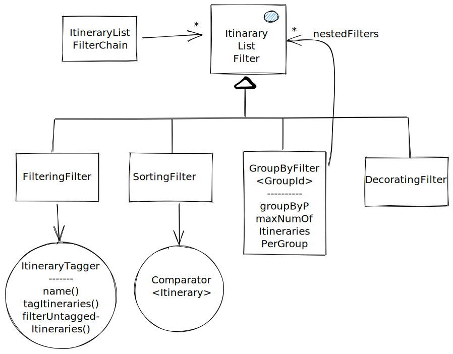

# ItineraryListFilterChain

ItineraryListFilterChain is a mechanism for post-processing itinerary results. It contains a list of
filters, which contain the business logic of each filter. The filters are not only for removing
itineraries, but can be also used for sorting, decorating or even adding new itineraries. The filter
chain is also responsible for creating routing errors, if all itineraries are deleted. It is also
responsible for removing the actual itineraries, if debugging is not turned on.

There are four types of filters, which can be included in the filter chain. The same type of filter
can appear multiple times.

## FilteringFilter

FilteringFilter is responsible for tagging itineraries for deletion. It does not remove any
itineraries directly, but uses `Itinerary#markAsDeleted(SystemNotice)` for this. A FilteringFilter is
instantiated with a ItineraryTagger, which contains the business logic for selecting the itineraries
for tagging. You can use `filterUntaggedItineraries()` for selecting if the tagger should

## SortingFilter

SortingFilter is responsible for sorting the itineraries. It does this by having a Comparator, which
is used for sorting.

## GroupByFilter

GroupByFilter is used to group itineraries together using a `GroupId`, and running a set of filters
on that subset of itineraries. This is used eg. to remove almost similar search results and to sort
them, so that only the best are shown to the user.

## DecoratingFilter

DecorationgFilter can be used to decorate the itineraries. This can be used eg to add information
about ticketing and fares for each itinerary, and refining the routing cost of the itinerary, which
might affect the sorting order of the itineraries, depending on the order of the filters.