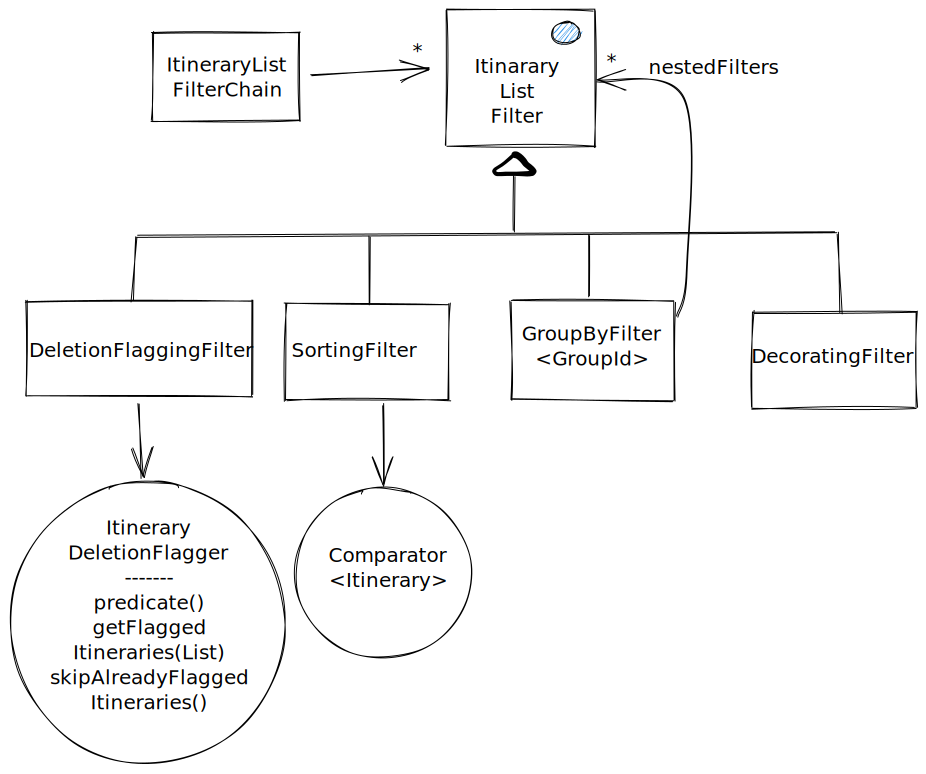

# ItineraryListFilterChain

ItineraryListFilterChain is a mechanism for post-processing itinerary results. There are filters 
for removing itineraries, sorting them and for decorating itineraries with more information like 
fares. The filter chain is also responsible for creating routing errors, if no itineraries remain
after filtering. Itineraries are flagged for deletion, but not deleted when debugging is turned on.
When debugging is off, the chain removes those itineraries after all filters are complete.



There are four types of filters, which can be included in the filter chain. The same type of filter
can appear multiple times.


## DeletionFlaggingFilter

DeletionFlaggingFilter is responsible for flagging itineraries for deletion. It does not remove any
itineraries directly, but uses `Itinerary#flagForDeletion(SystemNotice)` for this. A
DeletionFlaggingFilter is instantiated with a ItineraryDeletionFlagger, which contains the business
logic for selecting the itineraries for flagging. You can use `skipAlreadyFlaggedItineraries()` for
selecting if the filter should skip already flagged itineraries to the flagger. This is useful to
disable, in case already removed itineraries are useful in comparing whether other itineraries
should be flagged for removal.


## SortingFilter

SortingFilter is responsible for sorting the itineraries. It does this by having a Comparator, which
is used for sorting.


## GroupByFilter

GroupByFilter is used to group itineraries together using a `GroupId`, and running a set of filters
on that subset of itineraries. This is used eg. to remove almost similar search results and to sort
them, so that only the best are shown to the user.


## DecoratingFilter

DecorationgFilter can be used to decorate the itineraries. This can be used eg to add information
about ticketing and fares for each itinerary, and refining the routing cost of the itinerary, which
might affect the sorting order of the itineraries, depending on the order of the filters.


## Package structure

We try to separate use-case specific code (`filters`) and the generic filter chain implementation. 
Here is an overview of the packages and their responsibilities.

```
filterchain
├── api              Request parameters passed into the filter chain
├── filters          Concrete filter implementations  
│   ├── street       For decorating/filtering street itineraries  
│   ├── system       Mainly support for otp features like paging and search-window crop
│   └── transit      For decorating/filtering itineraries with transit
│       └── group    Transit group filters
├── framework        Generic filter chain implementation
│   ├── filter       Filter implementation
│   ├── filterchain  Domain logic used by the `FilterChain` (aggregate root).
│   ├── groupids     Generic groupId implementations. These can be used as lego to build specific group-by filters.
│   ├── sort         Sorting implementation
│   └── spi          The interfaces to extend to plug into the filter-chain
└── images           Images used in the doc

```
