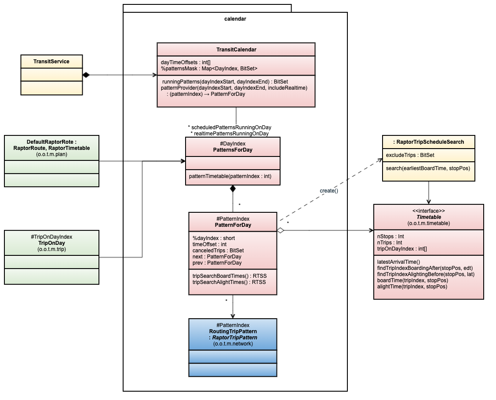

# Transit Calendar Model

### PatternsForDay

For a given day(start at 04:00 until 04:00+1d), list all patterns relevant for boarding or 
alighting on that day. A PatternForDay is included If it runs on that day. When searching for a 
pattern, we might have to look at the next or previous day to find an instance e can use as a 
starting point for the boarding search.

OTPs internal model will use a fixed time and time zone for all alight and board times. It do not 
follow the imported agency/operator time-zone or service time. We will keep enough information to 
be able to map back to the service time of the operator/agency. This is important to be able to 
match these in real-time updates.

## Use Cases/Features

Below are some main important features described.

###  Pattens Filtering

 - Describe the use of BitSet for filtering
 - Filtering with request parameters (modes, agencies, lines)
 - Filtering to find active patterns for stops reached in last round in Raptor
 - Optimizations: 
   - BitSets should be deduplicated
   - A Set can be used to combine all BitSets to eliminate BitSet merge operations
   - Cache `merge(stop : BitSet, activePatterns : BitSet) -> BitSet`. Many stops will have the same
     set of visiting patterns.

We can use patternMask to find all relevant patterns in a multi-day search - supporting journeys 
ending in another day. There is no need to distinguish between scheduled and realtime patterns for 
this, just make sure we include the super set.
