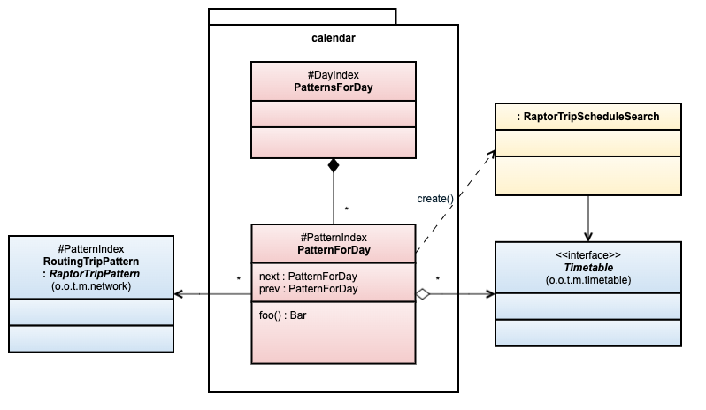
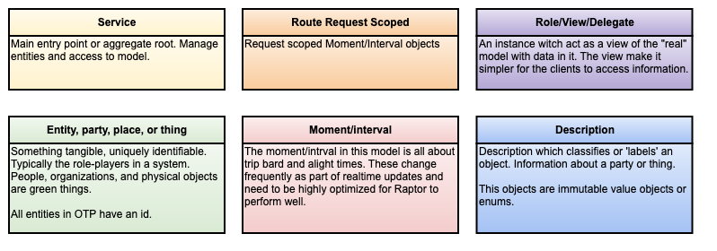
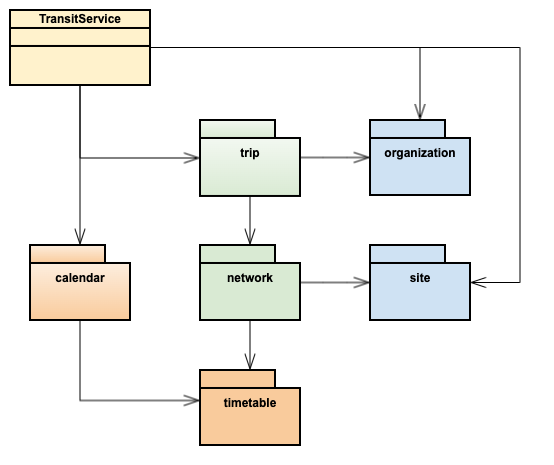

# Transit Model

DRAFT! THIS DOCUMENTATION IS NOT COMPLETE AND MIGHT BE OUT OF DATE COMPARED WITH THE CODE, AND 
VICE VERSA. 

 - The draft design will help us implement the new transit model, but it is too much work to keep 
   it "up to date". The audience is the developers actively working on refactoring the model.
 - We will use this doc as an "analyses and design" workbook. 
 - We will go over and make a "none draft" when it is time for review.


## Notation

### Diagram notations

Here is an example explaining most of the notation used in the diagrams.



- `A ––––– B` Strong reference. There is a relationship between A and B. A and B may reference
  each other, but the details are left to the implementation.
- `A ––––> B` Strong reference. There is a relationship between A and B. A has a reference to B.
- `A – – > B` Weak reference/uses: A uses B.
- Composition - `A ♦︎–> B` B is part of A and B is bound to the life-cycle of A.
- Aggregation - `A ♢–> B` B is part of A, but may live when A dies. B is shared.
 - The **calendar** package is the main package with all classes inside and its relations outside.
 - `(o.o.t.m.network)` means this class belong to the `org.opentripplanner.transit.model.network`
   package.
- `<< classifier >>` Used to mark interfaces or group types
 - `: RaptorTripPattern` means this class implements/extends `RaptorTripPattern`.
 - `(o.o.t.m.network)` means this class belong to the `org.opentripplanner.transit.model.network`
   package.
- `#patternIndex` - The pattern is indexed using an [integer index](#indexing-the-main-entities)


### UML Modeling in color

UML Diagrams are used to illustrate the model. Colors are used to emphasise relationships,
similarities or just visual grouping. For class diagrams we use a modified version of
[Object Modeling in Color](https://en.wikipedia.org/wiki/Object_Modeling_in_Color).



The colors indicate:

- Importance - For example green is more important than Blue.
- Complexity  - Red and Orange are usually more complex than blue and green. This can help focus on the difficult parts(design, test, document, change management) .
- Outside role(Purple). Play a role outside the model, for example in Raptor. Exist only to serve an outside party.
- Lifecycle
   - Blue(descriptions) - live forever
   - Green(entities…) - live for a long time, but may change over time
   - Read(Moment/Interval/Event) - live until the next realtime update
   - Orange - live in the scope of a request - a very short time
- Dependencies - Be careful when referencing short-lived type from long-lived types
   - Safe: Yellow ⟶ Orange ⟶ Red ⟶ Green ⟶ Blue
   - Not relevant for Purple


### 🚧 TODOs

The issue [#4002 - Transit model refactor for easier integration with RT-updaters and transit model maintenance](https://github.com/opentripplanner/OpenTripPlanner/issues/4002) contains a list of reminding tasks. Also, a lot of code is tagged with:

- `TODO RTM` - Refactor Transit Model


### ⚠️ Missing from the model

Some concepts and features are excluded from most of the design models - for simplicity. This is 
of cause not excluded from the code, but we focus on serving the main use-case - Raptor routing.

#### Missing concepts

- Mutable part of the model used by realtime updaters.
- Views and indexes making it easier for APIs to traverse the model.
- The model focus on relationships, not exact listing of fields and methods. 
- Some fields and methods are included to give the reader a better context, but not all.


#### Missing Features

- Wheelchair accessibility
- Constrained transfers


## Use Cases to supported

- Raptor search
   - w/ realtime, ignore realtime, include planned-cancellations
- Realtime updates
   - Cancel: Trip, Stop, Call(cancel either alighting or boarding, not both)
   - Replace/update: Trip, Stop, Call (update on arrival and/or departure times)
   - Insert/add: Trip, Stop, (Call, if it does not exist)
   - Planned information is kept and it should be possible to revert to planned, previous update is not

- Index (API data queries)
   - query(get, find, list) for all entities (Agency, Operator, Route, Trip, Stop ...) 
   - list Routes, Trips, TripPatterns for stop
   - list Rotes, Trips, Calls for a stop in a given period of time
- Frequency based and scheduled trips
- Support late platform assignment
- Support for routing with at least N seats. This requires request scoped patterns.


## Components (main packages)

The diagram show the main access point(`TransitService`) and the main packages and their 
dependencies.



(THIS IS WORK IN PROGRESS! The packages are probably almost ok, but the dependencies are not...)


 - [framework](framework/package.md) - framework to support other transit model classes.
 - basic - Value objects used across multiple packages.
 - organization - Agency(*Authority*), operator and contact info
 - site - StopLocation, RegularStop and Station +++ 
 - network - Route
 - trip - Trip and TripOnDate
 - transfers - Regular and constrained transfer information
 - [calendar](calendar/package.md) - Operating days and patterns on day
 - timetable - Trip times for one operating day and trip schedule search
 - trip schedule??? To avoid circular dependencies we might need to join trip and timetable
 - plan - Support trip planning by implementing Raptor SPI. This is the main entry point. 

## Plan query

The plan query is number ONE reason why OTP exist, and the primary design goal of the transit model
is to support the plan query to be as efficient "as possible".


TODO RTM - Add an object diagram witch show the main types involved in a Raptor trip plan query.

Main outline of Raptor[1] Algorithm

- Find the set of patterns[2] matching the request (q : BitSet = pattern indexes)
- Set access times for stops S reached
- Loop N times [3]:
   - For all patterns visiting stops with new arrivals
      - Board best trip in pattern
         - Alight at each stop in pattern
      - transfer from all stops reach by transit

1. Raptor, not Range Raptor(not relevant here)
2. By pattern here we mean RaptorTripPattern/RoutingTripPattern
3. N is the max number of transfers in the network


## Services and its context

The `TransitService` is the main entry point for accessing all transit model objects. It may have 
nested services or provide read-only access to key model classes. For changing the model a 
`TransitEditorService` is created(obtained from the service). The editor can then be used to get a
builder for all _aggregate roots_[1]. For simplicity, we only allow _one_ editor to be active at 
any given time. 

[TODO RTM, clarify] Modifying, adding and deleting entities are **not** synchronized, so if more 
than one thread are doing updates at concurrent, then the synchronization responsibility is put on 
the client (graph builders and RealTimeSnapshot). When all modification are complete, then changes 
are made active by calling the `commit()` on the context. Before the `commit()` the changes are not 
visible by e.g. the routing. [TODO Diagram]


## Indexing the main entities

Indexes is used to speed up the plan search. For most indexes we can use regular maps and 
references between entities. But, in some cases we want to optimize, and we use `int` based 
indexes. For example Raptor keep stop arrivals in big arrays - so Raptor expect the transit model
to pass in a stop index as an int, not the stop reference. In fact, Raptor never access the actual
Stop instance during the search. 

% is used as a prefix on fields and methods added to improve performance.

OTP uses int indexes for calendar-intervals, stops, trips, and trip patterns. These indexes allow 
us to avoid accessing these objects during the trip routing, and instead look these objects by
their indexes after the search - when creating the itineraries.


### `#stopIndex`

All stops are indexed, raptor do not access stops. Raptor keep its state in an array of stop 
arrivals, this matches the stop index.


### `#dayIndex`

The transit data model is broken into ~24h "periods"s or *operating days*, we reference these 
intervals using the **#dayIndex**.


### `#tripIndex` - TODO RTM

Both a trip reference and an index is returned by Raptor for each transit leg today. We should be
able to use only the index.


### `#patternIndex`

RaptorTripPattern are indexed, this allows us to use BitSet to represent a set of patterns. This
comes in handy when we want to find all patterns for a set of stops.


## Support for real-time updates

### RT-Notes
 - The real time information will be part of the TransitModel, not a separate Snapshot. So a trip
   will have both scheduled and realtime data. The RealTime updaters will copy parts of the model,
   change it and post it back tho the service, which apply the changes in a thread-safe way.
 - The data needed by for the routing will be put in a data structure optimized for routing. The 
   entities will not hold this data as fields, but be views of the data in the optimized model. 
   Fields/attributes not needed for trip routing will be part of the TransitModel objects.

### Design
This is a very early suggestion on how we want this to look - it is not based on a realistic 
use-case. The next step is to describe a couple RT updater use-cases - do a design for these and
test the design.

```Java
TransitModelEditor ctx = transitService().editTransitModel();

// To modify a trip we get the builder, change it, and call save() 
ctx.trip(id).withPrivateCode("CBP").save();

// A more common case would be to perform a change to a trip schedule on a given date
// We would like something like this. Here a combination of command and entity builders are used        
ctx.on(date).changePattern(patternMatcher).removeStop(stopId).save();
ctx.on(date).cancelTrip(tripMatcher).save();
ctx.on(date).updateTrip(matchId(tripId)).arrivalTime(stopId, arrTime).depatureTime(stopId, depTime).save();

// Revert an earlier update by going back to the planed version and apply new changes
// - for a given trip on date  
ctx.on(date).trip(id).revertToPlanned().withDelay(5m).save();
// - for all data for an agency
ctx.on(date).agency(id).revertToPlanned().trip(id).withDelay(5m).save();

// To update the model and make the changes visible to other threads
ctx.commit();
```