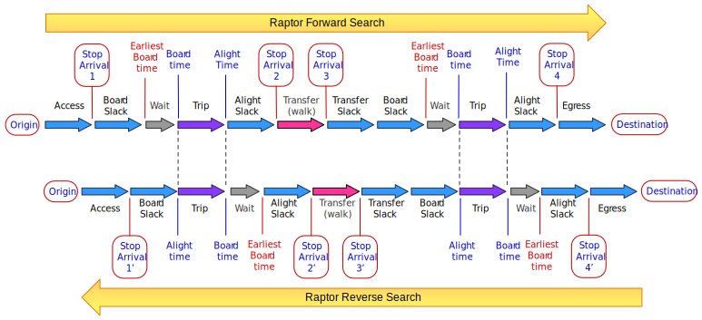

# Goal - Why replace AStar with Raptor?

We want to make the transit routing in OTP faster and at the same time better by changing from the 
existing A* (AStar) to a Raptor based algorithm. We want to keep all existing features or replace 
them with something at least as good. Some of the benefits are:

- faster travel search (our goal is at least 10 times faster)
- more and better variation in the result. We want  true support for multi-criteria search (arrival 
time, transfers, travel duration, operator, weight/cost ...) 

Changing the algorithm also mean that we will create a new data structure for transit - optimized 
for Raptor. The existing routing graph will be used for _none_ transit search, but transit data 
will be removed.

# Terminology
The *Raptor* algorithm is described in [a paper](https://www.microsoft.com/en-us/research/wp-content/uploads/2012/01/raptor_alenex.pdf) 
by Microsoft from 2012. We plan to use the _Range Raptor_ with _Multi-criteria pareto-optimal_ search.

## Raptor
Raptor is a graph algorithm that works in _rounds_. The search start from a list of access stops 
and arrival times (initial _stop-arrivals_). Then for each _route_ serving these stops the best 
trips is explored. Each _trip_ will take you to a new set of _stops_ with new _stop-arrivals_. 
Then transfers from all stops reached is used to further reach new stops. This process is repeated, 
each iteration of transit and transfers is called a _round_. For every _round_ a new list of 
_stop-arrivals_ is found. This new list of _stop-arrivals_ is used as input for the nest round. 
The algorithm will terminate by it self(all reachable stops are visited), or can be stopped when 
you have the desired results. The reason this is much faster than the current OTP A* is that there 
is no need to maintain a priority queue of edges to explore. For each stop we keep the best 
_stop arrival_ witch have a link to the previous _stop-arrival_ so we can compute the _path_ when 
the search is complete.

## Range Raptor (RR)
_Range Raptor_ works in iterations over minutes. Let say you want to travel from A to B sometime 
between 12:00 and 13:00. Then _Range Raptor_ start at 13:00, and for each minute run the search 
again: 12:59, 12:58 ... until 12:00. The way Raptor works enable us to do this in a super efficient 
way only adding a small percentage to overall performance (compared to a single Raptor search). 
This also make sure that we find the "best" trip with the combination of latest departure time 
and earliest arrival time, with all legs "packed" towards the beginning of the trip. Raptor 
grantee finding the best trip in that period with departure time _after_ 12:00 o'clock and leaving 
no later than 13:00. The "optimal trip" guarantee is only valid for the _search-time-window_; There 
might be a trip leaving after 13:00 that is faster than the trips found. 

## Multi-criteria Range Raptor (McRR) 
Raptor gives us the optimal trip based on _arrival time_. With some overhead we can add _number of 
transfers_. _Range Raptor_ also gives us the shortest travel duration (within its search window). 
But we want more - OTP is today only optimized on cost, witch is a mix of _time, waiting time, 
walking distance, transfers_ and so on. So, a McRR search will return a *pareto-optimal* set of 
paths with at least these criteria:
- arrival time (seconds)
- number of transfers (scalar)
- travel duration (seconds)
- generalized cost (scalar) (a function of anything else than mention above)

We will also experiment with extracting other criteria from the _cost_ like _walkingDistance_,  
_operator_. The goal is to make this configurable so each deployment may tune this to their needs. 
Due to performance reasons it might not be 100% dynamic.

Because _Raptor_ is much faster than the _multi-criteria_ Raptor we will provide an option 
(request parameter) to run both _RR_  and _McRR_. We might even use _RR_ as a heuristics 
optimization for McRR. In a bench mark test, RR takes on average 80ms while McRR with the same 
configuration takes 400ms. If we add _walking distance_ as an extra criteria the average time 
increase to 1000ms. (The numbers provided are for relative comparison - it is to early to compare 
with the existing OTP performance).

## Paths and Itineraries 
In this context, Path and Itineraries are almost the same. We use *Path* to talk about the minimum 
set of data returned by Raptor, then these paths are decorated with more information and returned 
to the end user as Itineraries. 

## Pareto optimal/efficiency set
All paths that is considered *pareto optimal* for a set of criteria is returned by the McRR. This 
can be a large set (like 500 paths), so we need to reduce this by applying a filter to the set of 
paths and further a final filter to the itineraries (paths decorated with more info). The idea 
here is to have a configurable filter-chain with decorating, mapping, sorting and filtering 
capabilities.

### Pareto-set explained
See [Wikipedia](https://en.wikipedia.org/wiki/Pareto_efficiency) A pareto-set of paths/itineraries 
is a set where all elements are better (less than) for at least one criteria than all other 
elements in the set. Given a set `{ [9,2], [5,6],  [3, 8] }` then `[7, 4]` would make it into the 
set. This is because  7 < 9 (comparing the 1sr criteria, element 1), while 4 < 6 and 8 (comparing 
the 2nd criteria, element 2 and 3). `[6,7]` would not make it into the set because `[5,6]` is 
better for both criteria.

# Features
## Algorithm implementation
- Algorithms
    - Raptor (Range Raptor with one iteration)
    - Range Raptor
    - Multi-criteria Range Raptor
        - Arrival time
        - Number of transfers
        - Travel duration
        - Generalized Cost
    - Dynamic search-window
    
## Filters
Filtering on stops was implemented and tested with heuristics. We tested removing all stops which 
could not be part of an optimal path, but this did not have a significant performance impact. If 
Routes, Trips or Stops can be filtered it is probably better to do it in the transit layer, not in 
Raptor. Hence; We have removed the stop filter (c96d1af0).

# Design
The Raptor implementation is implemented as a Java library with its own API and has a single point 
of access the`RaptorService`. 
- It is self contained and have no dependencies to any other library or code inside OTP (except a 
few utility functions). 
- It is modular, with several plugable components. The wiring is done in separate assembly classes 
(configure classes).
- To provide Transit data for the algorithm you need to implement a _data provider_.

## Optimizations
- Limit on `maxAdditionalNumberOfTransfers` not `maxNumberOfTransfers`. We want to change this to 
be relative to the trip with fewest transfers.
- Limit on *destination pareto-set* (not just time). Doing this the first time (not every time) we 
arrive at a stop might give the best performance.
- Use _R_ or _RR_ as a "heuristics optimization", possible bi-directional, computing a set of 
stops/routes that can be used as a filter for the _McRR_. _RR_ is super fast, more than 10x faster 
than McRR with 4 criteria.

## Understanding the search (range-raptor algorithm implementation)
The `RangeRaptorWorker` and the `RoutingStrategy` together implement the _range-raptor_ 
algorithm. There are 3 `RoutingStrategy` implementations:
1. The `StdTransitWorker` is the standard Range Raptor implementation. Support both _forward_ and 
_reverse_ search.
1. The `NoWaitTransitWorker` is the same as the standard, but it eliminates _wait-time_. It support 
both _forward_ and _reverse_ search. It is very fast, and can be used to compute various 
heuristics, like _minimum-number-of-transfers_, _minimum-travel-time_ and 
_earliest-possible-arrival-time_.
1. The `McTransitWorker` is the _Multi-Criteria Range Raptor_ implementation. It does **not** 
support _reverse_ search - so fare there has not been a need for it.
 
The Range Raptor Search support both _Forward_ and _Reverse_ search. In the diagram below, the same 
journey is shown using the _forward_ and _reverse_ search. The to trips have the exact same 
legs, but some of the calculated times are slightly different. Note! If you remove or time-shift 
the _Wait_ parts you will get the exact same result.  

Some important notes to the diagram above:

- The _Stop Arrival_ (or _Stop Arrival Time_) is the decisions points of the algorithm. This is 
were a path is ACCEPTED, REJECTED or DROPPED, based on the existing _Stop Arrival State_. The 
`Stop Arrivaal 1` and `Stop Arrival 1'` represent the same _stop arrival_ at **stop 1** for the
same path, but at times are different. A _Forward Raptor Search_ will _time-shift_ the trip to the
left, while a _Reverse Raptor Search_ wil time-shift the trip to the right.
- The _Transfer (walk)_ is calculated by Raptor only if you need to walk from one stop to another. 
If a transfer between two routes take place in the same location/stop, then Raptor uses the 
calculated transit arrival, instead of calculating a new transit arrival. In the diagram you can 
remove the transit arrow and `Stop Arrival 3` and `2'`. The _Stop Arrival 2_ and _Stop Arrival 3'_ 
then represent the same stop arrival at the same stop. 
- There is no important timing point between the _transfer-slack_ and the _board-slack_, so the 
order does not matter. In the algorithm the _transfer-slack_ is eliminated and it is left to the 
internal Raptor `SlackProvider` to include the _transfer-slack_ in the _bord-slack_(forward search)
or in the _alight_slack_(reverse-search).
- It might look odd that the _board-slack_ comes before the _wait_ part, but this is just a small 
trick to be able to calculate the _earliest-board-time_. Remember that the parts between 2 
_stop-arrivals_ can technically be swapped around without any effect on the algorithm. Of cause 
the result paths need to be adjusted to reflect this. 
- The path(itinerary) mapping process should swap the parts between to _stop-arrivals_ into an  
intuitive order seen from a user perspective, this may include time-shifting access or egress.
- The _wait_ after the access and before the egress leg should be removed by the itinerary mapper.
- In a _reverse-search_ the `Worker` code is the same - the exact same algorithm implementation is 
used. To be able to do this, a special _reverse_ `TransitCalculator`, `SlackProvider` and 
`TripScheduleSearch` is injected into the `RaptorWorker`. The terminology in the diagram above is 
the terminology used in the algorithm (`worker`). For example the _board-time_ and _alight-time_ 
is swapped, compared with the `RaptorTripSchedule` in the _transit-layer_.  
  - So be aware that the `ReverseSearchTransitCalculator` have some awkward variable names - 
  depending on the point-of-view.   
  - The `TripScheduleAlightSearch` search the _alight-times_ and return it as a _board-time_. 

### The transfer-slack is added to the board-slack, why?
The _transfer-slack_ is incorporated into the _board-slack_, instead of being applied to the 
transfer for the following reasons: 
- It is valid to do so. The Raptor algorithm branching happens at _stop-arrivals_ where the arrivals
  are compared. Therefor it is important that the comparison is fare. You can arrive at a stop by 
  access/transfer or transit. So, because the _transfer-slack_ is constant we can safely remove it 
  from transfer-arrivals at a particular stop and add it to all transit-legs leaving from the same 
  stop. 
  - This is useful, because we do not have zero distance transfer-stop-arrivals in the state. 
    (The transit-arrival is used in the next round).  
  - This also allow using the stop-arrival(transit only) to continue onto the _egress-leg_ - 
    without any _transfer-slack_ added. 
- It does not have any effect on the performance. Adding a constant to the dynamically calculated 
  _board-slack_ do not have any significant influence on the performance.  
