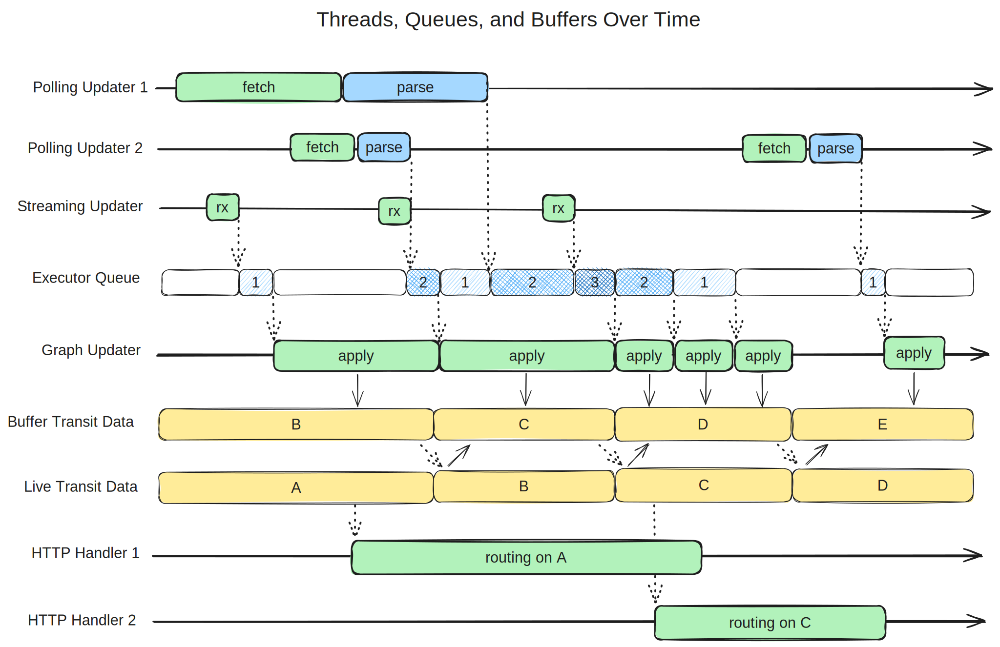

# Realtime Updaters

## Realtime Concurrency Overview

The following approach to realtime concurrency was devised around 2013 when OTP first started consuming realtime data that affected routing results rather than just displaying messages. At first, the whole realtime system followed this approach. Some aspects of this system were maintained in subsequent work over the years, but because the details and rationale were not fully documented, misinterpretations and subtle inconsistencies were introduced.

On 11 January 2024 a team of OTP developers reviewed this realtime concurrency approach together. The conclusion was that this approach remains sound, and that any consistency problems were not due to the approach itself, but rather due to its partial or erroneous implementation in realtime updater classes. Therefore, we decided to continue applying this approach in any new work on the realtime subsystem, at least until we encounter some situation that does not fit within this model. All existing realtime code that is not consistent with this approach should progressively be brought in line with it. 

The following is a sequence diagram showing how threads are intended to communicate. Unlike some common forms of sequence diagrams, time is on the horizontal axis here. Each horizontal line represents either a thread of execution (handling incoming realtime messages or routing requests) or a queue or buffer data structure. Dotted lines represent object references being handed off, and solid lines represent data being copied.

At the top of the diagram are the GraphUpdater implementations. These fall broadly into two categories: polling updaters and streaming updaters. Polling updaters periodically send a request to server (often just a simple HTTP server) which returns a file containing the latest version of the updates. Streaming updaters are generally built around libraries implementing message-oriented protocols such as AMQP or WebSockets, which fire a callback each time a new message is received. Polling updaters tend to return a full dataset describing the entire system state on each polling operation, while streaming updaters tend to receive incremental messages targeting individual transit trips. As such, polling updaters execute relatively infrequently (perhaps every minute or two) and process large responses, while streaming updaters execute very frequently (often many times per second) and operate on small messages in short bursts. Polling updaters are simpler in many ways and make use of common HTTP server components, but they introduce significant latency and redundant communication. Streaming updaters require more purpose-built or custom-configured components including message brokers, but bandwidth consumption and latency are lower, allowing routing results to reflect vehicle delays and positions immediately after they're reported.

The GraphUpdaterManager coordinates all these updaters, and each runs freely in its own thread, receiving, deserializing, and validating data on its own schedule. Importantly, the GraphUpdaters are _not allowed to directly modify the transit data (Graph)_. Instead, they submit instances of GraphWriterRunnable which are queued up using the WriteToGraphCallback interface. These instances are essentially deferred code snippets that _are allowed_ to write to the Graph, but in a very controlled way. In short, there is exactly one thread that is allowed to make changes to the transit data, and those changes are queued up and executed in sequence, one at a time.

As mentioned above, these GraphWriterRunnable instances must write to the transit data model in a very controlled way, following specific rules. They operate on a buffer containing a shallow copy of the whole transit data structure, and apply a copy-on-write strategy to avoid corrupting existing objects that may be visible to other parts of the system. When an instance is copied for writing, any references to it in parent objects must also be updated. Therefore, writes cause cascading copy operations, and all instances in the object tree back up to the root of the transit data structure must also be copied. As an optimization, if a GraphWriterRunnable is able to determine that the protective copy has already been made in this buffer (the part of the structure it needs to modify is somehow marked as being "dirty") it does not need to make another copy. If the update involves reading the existing data structure before making a change, those reads should be performed within the same contiguous chunk of deferred logic that performs the corresponding write, ensuring that there are no data races between write operations.

This writable buffer of transit data is periodically made immutable and swapped into the role of a live snapshot, which is ready to be handed off to any incoming routing requests. Each time an immutable snapshot is created, a new writable buffer is created by making a shallow copy of the root instance in the transit data aggreagate. This functions like a double-buffering system, except that any number of snapshots can exist at once, and large subsets of the data can be shared across snapshots. As older snapshots (and their component parts) fall out of use, they are dereferenced and become eligible for garbage collection. Although the buffer swap could in principle occur after every write operation, it can incur significant copying and indexing overhead. When incremental message-oriented updaters are present this overhead would be incurred more often than necesary. Snapshots can be throttled to occur at most every few seconds, thereby reducing the total overhead at no perceptible cost to realtime visibility latency.

This is essentially a multi-version snapshot concurrency control system, inspired by widely used database engines (and in fact informed by books on transactional database design). The end result is a system where 1) writing operations are simple to reason about and cannot conflict because only one write happens at a time; 2) multiple read operations (including routing requests) can occur concurrently; 3) read operations do not need to pause while writes are happening; 4) read operations see only fully completed write operations, never partial writes; and 5) each read operation sees a consistent, unchanging view of the transit data.

Importantly, no locking is necessary, though some form of synchronization is applied during the buffer swap operation to impose a consistent view of the whole data structure via a happens-before relationship as defined by the Java memory model. (While pointers to objects can be handed between threads with no read-tearing of the pointer itself, there is no guarantee that the web of objects pointed to will be consistent without some explicit synchronization at the hand-off.)

Arguably the process of creating an immutable live snapshot (and a corresponding new writable buffer) should be handled by a GraphWriterRunnable on the single graph updater thread. This would serve to defer any queued modifications until the new buffer is in place, without introducing any further locking mechanisms.

